# multimedia_av_codec 模块架构总览

## 1. 模块职责与边界

multimedia_av_codec 模块为 OpenHarmony 提供统一的音视频编解码、封装（Muxer）、解封装（Demuxer）能力。模块通过 C API（CAPI）对外暴露接口，JS 层通过 `@ohos.multimedia.media.d.ts` 声明进行调用。

**核心职责**:
- 音频编解码（AAC/MP3/FLAC/Vorbis/Opus/AMR/G711/APE 等格式）
- 视频编解码（H.264/H.265/AV1/VP8/VP9/VVC/MPEG2/MPEG4 等）
- 媒体封装（Muxer）：将编码后的音视频数据封装为 MP4/M4A/AMR/MP3/WAV/AAC/FLAC/OGG 格式
- 媒体解封装（Demuxer）：从媒体文件中提取音视频帧数据
- 编解码能力查询（Capability）：查询系统支持的编解码器及其参数范围
- DRM 解密支持（CencInfo）：通过 DRM 框架实现加密内容的解密播放

**模块边界**:
- 本模块不负责音频渲染和视频显示（由 AudioRenderer/Surface 负责）
- 本模块不负责媒体播放控制（由 media_player 模块负责）
- 本模块不直接管理 DRM 许可证获取（由 drm 模块负责）

## 2. 组件层次与模块划分

### 2.1 接口层（Interfaces）

#### C API 公开头文件（11 个）
源码路径: `interfaces/kits/c/`

| 头文件 | 子系统 | 说明 |
|--------|--------|------|
| `native_avcodec_base.h` | CodecBase | 基础定义：回调类型、MIME 类型、枚举、格式键 |
| `native_avcodec_audiodecoder.h` | AudioDecoder | 音频解码器（deprecated since 11，推荐使用 AudioCodec） |
| `native_avcodec_audioencoder.h` | AudioEncoder | 音频编码器（deprecated since 11，推荐使用 AudioCodec） |
| `native_avcodec_videodecoder.h` | VideoDecoder | 视频解码器 |
| `native_avcodec_videoencoder.h` | VideoEncoder | 视频编码器 |
| `native_avcodec_audiocodec.h` | AudioCodec | 统一音频编解码器（since 11，推荐替代） |
| `native_avcapability.h` | Capability | 编解码能力查询 |
| `native_avsource.h` | AVSource | 媒体源创建与管理 |
| `native_avdemuxer.h` | AVDemuxer | 媒体解封装 |
| `native_avmuxer.h` | AVMuxer | 媒体封装 |
| `native_cencinfo.h` | CencInfo | DRM 加密信息设置 |
| `avcodec_audio_channel_layout.h` | CodecBase | 音频通道布局定义 |

#### 内部 API 头文件
源码路径: `interfaces/inner_api/native/`

| 头文件 | 说明 |
|--------|------|
| `avcodec_errors.h` | 内部错误码定义（AVCS_ERR_*） |
| `avcodec_audio_decoder.h` | 音频解码器内部接口 |
| `avcodec_audio_encoder.h` | 音频编码器内部接口 |
| `avcodec_video_decoder.h` | 视频解码器内部接口 |
| `avcodec_video_encoder.h` | 视频编码器内部接口 |
| `avcodec_audio_codec.h` | 统一音频编解码器内部接口 |
| `avcodec_list.h` | 编解码能力列表内部接口 |
| `avsource.h` | AVSource 内部接口 |
| `avdemuxer.h` | Demuxer 内部接口 |
| `avmuxer.h` | Muxer 内部接口 |
| `avcodec_common.h` | 公共类型定义 |
| `avcodec_info.h` | 编解码器信息 |
| `avcodec_mime_type.h` | MIME 类型常量 |
| `avcodec_monitor.h` | 编解码器监控 |
| `avcodec_suspend.h` | 编解码器挂起/恢复 |

### 2.2 CAPI 实现层
源码路径: `frameworks/native/capi/`

| 文件 | 说明 |
|------|------|
| `avcodec/native_audio_decoder.cpp` | OH_AudioDecoder_* 系列 CAPI 实现，封装 AudioDecoderObject |
| `avcodec/native_audio_encoder.cpp` | OH_AudioEncoder_* 系列 CAPI 实现 |
| `avcodec/native_video_decoder.cpp` | OH_VideoDecoder_* 系列 CAPI 实现，封装 VideoDecoderObject |
| `avcodec/native_video_encoder.cpp` | OH_VideoEncoder_* 系列 CAPI 实现 |
| `avcodec/native_audio_codec.cpp` | OH_AudioCodec_* 统一编解码 CAPI 实现 |
| `avcodec/native_avcodec_base.cpp` | 基础类型辅助实现 |
| `common/native_avcapability.cpp` | OH_AVCodec_GetCapability 等 CAPI 实现 |
| `avsource/native_avsource.cpp` | OH_AVSource_* 系列 CAPI 实现 |
| `avdemuxer/native_avdemuxer.cpp` | OH_AVDemuxer_* 系列 CAPI 实现 |
| `avmuxer/native_avmuxer.cpp` | OH_AVMuxer_* 系列 CAPI 实现 |
| `avcencinfo/native_cencinfo.cpp` | OH_AVCencInfo_* 系列 CAPI 实现 |
| `common/hiappevent_util.cpp` | DFX 事件上报工具 |

### 2.3 框架层（Framework）
源码路径: `frameworks/native/`

| 目录 | 说明 |
|------|------|
| `avcodec/` | 编解码器框架实现，包含 AudioDecoderFactory/VideoDecoderFactory 等工厂类 |
| `avsource/` | AVSource 框架实现，包含 AVSourceFactory |
| `avdemuxer/` | Demuxer 框架实现，包含 DemuxerFactory |
| `avmuxer/` | Muxer 框架实现，包含 AVMuxerFactory |

### 2.4 服务层（Services）

#### 编解码引擎
源码路径: `services/engine/codec/`

| 子目录 | 说明 |
|--------|------|
| `audio/` | 音频编解码引擎核心 |
| `audio/decoder/` | 音频解码器插件（基于 FFmpeg）: AAC/MP3/FLAC/Vorbis/AMR/G711/Opus |
| `audio/encoder/` | 音频编码器插件（基于 FFmpeg）: AAC/FLAC/G711/Opus |
| `video/` | 视频编解码引擎 |
| `video/hcodec/` | 硬件编解码器适配层（HD Codec） |
| `video/fcodec/` | FFmpeg 软件编解码器适配层 |
| `video/avcencoder/` | H.264 编码器 |
| `video/hevcdecoder/` | H.265 解码器 |
| `video/av1decoder/` | AV1 解码器 |
| `video/vpxdecoder/` | VP8/VP9 解码器 |
| `video/decoderbase/` | 视频解码器基础类 |

#### 编解码 IPC 服务
源码路径: `services/services/codec/`

编解码器的 IPC 客户端/服务端实现，支持跨进程调用。

#### 媒体引擎
源码路径: `services/media_engine/`

| 子目录 | 说明 |
|--------|------|
| `filters/` | 媒体处理过滤器管线（Demuxer/Decoder/Encoder/Muxer 等 Filter） |
| `plugins/ffmpeg_adapter/` | FFmpeg 适配插件 |
| `plugins/ffmpeg_adapter/audio_decoder/` | FFmpeg 音频解码器插件（AAC/MP3/FLAC/AC3/APE/Opus 等） |
| `plugins/ffmpeg_adapter/audio_encoder/` | FFmpeg 音频编码器插件（AAC/FLAC/MP3 等） |
| `plugins/ffmpeg_adapter/demuxer/` | FFmpeg 解封装插件 |
| `plugins/ffmpeg_adapter/muxer/` | FFmpeg 封装插件 |
| `modules/demuxer/` | Demuxer 核心模块（MediaDemuxer/StreamDemuxer 等） |
| `modules/muxer/` | Muxer 核心模块（MediaMuxer） |
| `modules/media_codec/` | MediaCodec 模块 |
| `modules/sink/` | 媒体输出 Sink（AudioSink/VideoSink） |
| `modules/source/` | 媒体源模块 |

#### DFX 诊断
源码路径: `services/dfx/`

| 文件 | 说明 |
|------|------|
| `avcodec_dfx_component.cpp` | DFX 组件（性能打点、故障上报） |
| `avcodec_dump_utils.cpp` | 状态转储工具 |
| `avcodec_sysevent.cpp` | 系统事件上报 |
| `avcodec_xcollie.cpp` | 看门狗/超时监控 |
| `include/avcodec_log.h` | 日志宏定义 |
| `include/avcodec_trace.h` | 性能追踪（HiTrace） |

## 3. 依赖关系

### 3.1 内部依赖

```
C API 层 (interfaces/kits/c/*.h)
    |
    v
CAPI 实现层 (frameworks/native/capi/*.cpp)
    |  依赖内部 API 头文件
    v
框架层 (frameworks/native/avcodec/, avsource/, avdemuxer/, avmuxer/)
    |  通过工厂模式创建实例
    v
服务层 (services/)
    ├── engine/codec/ (编解码引擎)
    ├── services/codec/ (IPC 服务)
    ├── media_engine/ (媒体引擎: filters + plugins + modules)
    └── dfx/ (DFX 诊断)
```

### 3.2 外部依赖

| 依赖项 | 说明 |
|--------|------|
| FFmpeg | 音视频编解码/封装/解封装的底层实现引擎 |
| HD Codec (HDIDec) | 硬件视频编解码器（通过 HDI 接口） |
| OH_NativeWindow | 视频解码的 Surface 输出渲染 |
| DRM Framework | 加密内容的许可证管理和解密 |
| HiLog / HiTrace | 日志输出和性能追踪 |
| HiAppEvent | 应用事件打点（DFX） |
| NetworkSecurityConfig | HTTP 明文传输策略检查（AVSource URI 模式） |
| AVBuffer / AVSharedMemory | 音视频数据缓冲区管理 |
| OH_AVFormat | 媒体描述格式管理 |

## 4. 组件关系图

```mermaid
flowchart TB
    subgraph PublicAPI["C API 公开接口层"]
        AD["OH_AudioDecoder_*<br/>(native_avcodec_audiodecoder.h)"]
        AE["OH_AudioEncoder_*<br/>(native_avcodec_audioencoder.h)"]
        AC["OH_AudioCodec_*<br/>(native_avcodec_audiocodec.h)"]
        VD["OH_VideoDecoder_*<br/>(native_avcodec_videodecoder.h)"]
        VE["OH_VideoEncoder_*<br/>(native_avcodec_videoencoder.h)"]
        CAP["OH_AVCapability_*<br/>(native_avcapability.h)"]
        SRC["OH_AVSource_*<br/>(native_avsource.h)"]
        Dmx["OH_AVDemuxer_*<br/>(native_avdemuxer.h)"]
        Mux["OH_AVMuxer_*<br/>(native_avmuxer.h)"]
        CENC["OH_AVCencInfo_*<br/>(native_cencinfo.h)"]
        BASE["OH_AVCodec Base<br/>(native_avcodec_base.h)"]
    end

    subgraph CAPIImpl["CAPI 实现层"]
        ADI["native_audio_decoder.cpp<br/>AudioDecoderObject"]
        AEI["native_audio_encoder.cpp"]
        ACI["native_audio_codec.cpp<br/>AVCodecAudioCodecImpl"]
        VDI["native_video_decoder.cpp<br/>VideoDecoderObject"]
        VEI["native_video_encoder.cpp"]
        CAPI["native_avcapability.cpp<br/>AVCodecList"]
        SRCI["native_avsource.cpp<br/>AVSourceObject"]
        DmxI["native_avdemuxer.cpp<br/>DemuxerObject"]
        MuxI["native_avmuxer.cpp<br/>AVMuxerObject"]
        CENCI["native_cencinfo.cpp"]
    end

    subgraph Framework["框架层"]
        ADFW["AVCodecAudioDecoder<br/>AudioDecoderFactory"]
        AEFW["AVCodecAudioEncoder<br/>AudioEncoderFactory"]
        VDFW["AVCodecVideoDecoder<br/>VideoDecoderFactory"]
        VEFW["AVCodecVideoEncoder<br/>VideoEncoderFactory"]
        SRCFW["AVSource<br/>AVSourceFactory"]
        DmxFW["AVDemuxer<br/>DemuxerFactory"]
        MuxFW["AVMuxer<br/>AVMuxerFactory"]
    end

    subgraph Service["服务层"]
        subgraph Engine["编解码引擎"]
            AEng["Audio Engine<br/>(FFmpeg Plugins)"]
            VEngSW["Video Engine SW<br/>(fcodec/FFmpeg)"]
            VEngHW["Video Engine HW<br/>(hcodec/HDI)"]
        end
        subgraph MediaEng["媒体引擎"]
            Filters["Filters Pipeline"]
            Plugins["FFmpeg Plugins"]
            Modules["Demuxer/Muxer<br/>Modules"]
        end
        IPC["IPC Service"]
    end

    subgraph DFX["DFX 诊断"]
        LOG["avcodec_log"]
        TRACE["avcodec_trace"]
        SYSEVT["avcodec_sysevent"]
        COLLIE["avcodec_xcollie"]
        DUMP["avcodec_dump_utils"]
    end

    AD --> ADI
    AE --> AEI
    AC --> ACI
    VD --> VDI
    VE --> VEI
    CAP --> CAPI
    SRC --> SRCI
    Dmx --> DmxI
    Mux --> MuxI
    CENC --> CENCI

    ADI --> ADFW
    AEI --> AEFW
    ACI --> ADFW
    ACI --> AEFW
    VDI --> VDFW
    VEI --> VEFW
    SRCI --> SRCFW
    DmxI --> DmxFW
    MuxI --> MuxFW

    ADFW --> AEng
    AEFW --> AEng
    VDFW --> VEngSW
    VDFW --> VEngHW
    VEFW --> VEngHW
    SRCFW --> Modules
    DmxFW --> Modules
    MuxFW --> Modules

    AEng --> Plugins
    VEngSW --> Plugins
    Modules --> Plugins
    Modules --> Filters

    ADFW --> IPC
    VDFW --> IPC
    CAPI --> IPC

    ADI -.-> LOG
    VDI -.-> TRACE
    SRCI -.-> SYSEVT
    VDFW -.-> COLLIE
    VDFW -.-> DUMP
```



## 5. 关键架构特征

### 5.1 CAPI 桥接模式

本模块使用 CAPI（C API）桥接模式而非 NAPI 模式。每个 CAPI 函数对应一个 `*Object` 结构体，该结构体继承自公开的 opaque 类型（如 `OH_AVCodec`），内部持有对应的 Framework 层智能指针。

例如 `AudioDecoderObject` 结构定义于 `frameworks/native/capi/avcodec/native_audio_decoder.cpp`:

```cpp
struct AudioDecoderObject : public OH_AVCodec {
    explicit AudioDecoderObject(const std::shared_ptr<AVCodecAudioDecoder> &decoder)
        : OH_AVCodec(AVMagic::AVCODEC_MAGIC_AUDIO_DECODER), audioDecoder_(decoder) {}
    const std::shared_ptr<AVCodecAudioDecoder> audioDecoder_;
    // ... 回调、缓冲区管理等成员
};
```

CAPI 层通过 magic 字段进行类型安全校验（如 `AVCODEC_MAGIC_AUDIO_DECODER`）。

### 5.2 工厂模式

所有子系统的实例创建均通过工厂模式:
- `AudioDecoderFactory::CreateByMime()` / `CreateByName()`
- `AudioEncoderFactory::CreateByMime()` / `CreateByName()`
- `VideoDecoderFactory::CreateByMime()` / `CreateByName()`
- `VideoEncoderFactory::CreateByMime()` / `CreateByName()`
- `AVSourceFactory::CreateWithFD()` / `CreateWithURI()` / `CreateWithDataSource()`
- `DemuxerFactory::CreateWithSource()`
- `AVMuxerFactory::CreateAVMuxer()`
- `AVCodecListFactory::CreateAVCodecList()`

### 5.3 错误码转换

内部错误码（`AVCS_ERR_*`，定义于 `interfaces/inner_api/native/avcodec_errors.h`）通过 `AVCSErrorToOHAVErrCode()` 函数转换为公开错误码（`AV_ERR_*`，定义于 `native_averrors.h`）。转换逻辑在 CAPI 实现层的每个函数返回时统一调用。

### 5.4 DFX 事件上报

每个 CAPI 入口函数均创建 `ApiInvokeRecorder` 对象用于记录 API 调用事件（源码: `frameworks/native/capi/common/hiappevent_util.cpp`），由 `AppEventReporter` 统一上报至 HiAppEvent。

### 5.5 异步回调模式

编解码器支持两种回调模式:
- **OH_AVCodecAsyncCallback**（deprecated since 11）: 使用 `OH_AVMemory` 传递数据
- **OH_AVCodecCallback**（since 11，推荐）: 使用 `OH_AVBuffer` 传递数据

回调包装类（如 `NativeAudioDecoder`、`NativeVideoDecoderCallback`）在 CAPI 层实现 `AVCodecCallback` 接口，负责将内部回调解包后转发给用户的 C 回调函数。

### 5.6 同步模式（since 20）

编解码器新增同步模式支持（通过 `OH_MD_KEY_ENABLE_SYNC_MODE` 配置），使用 `QueryInputBuffer`/`GetInputBuffer`/`QueryOutputBuffer`/`GetOutputBuffer` 替代异步回调。
