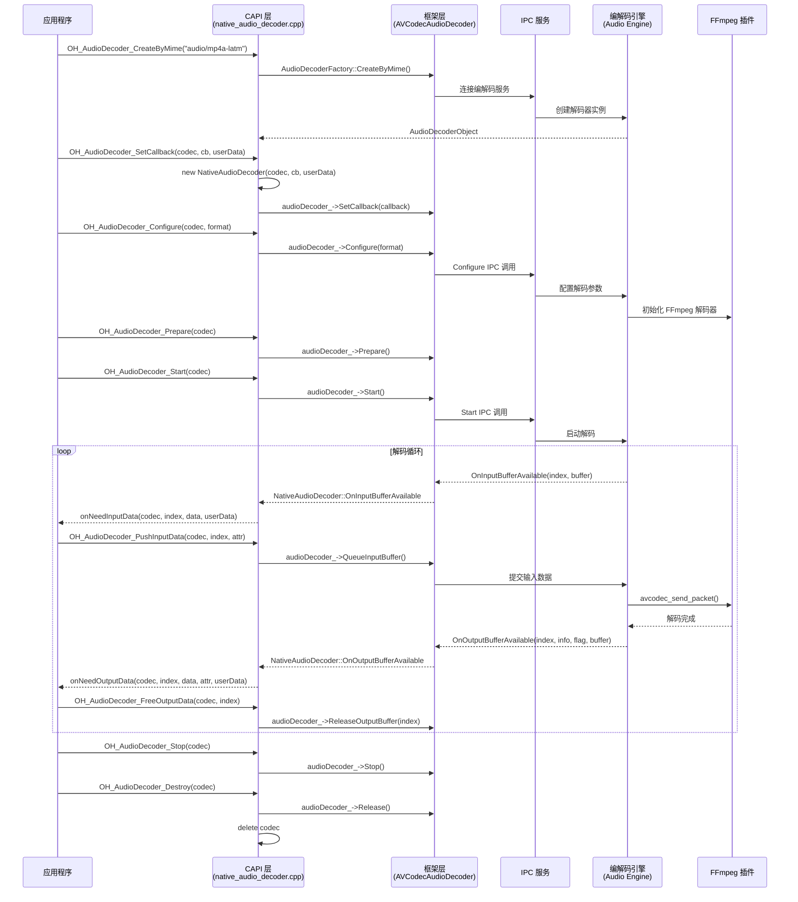
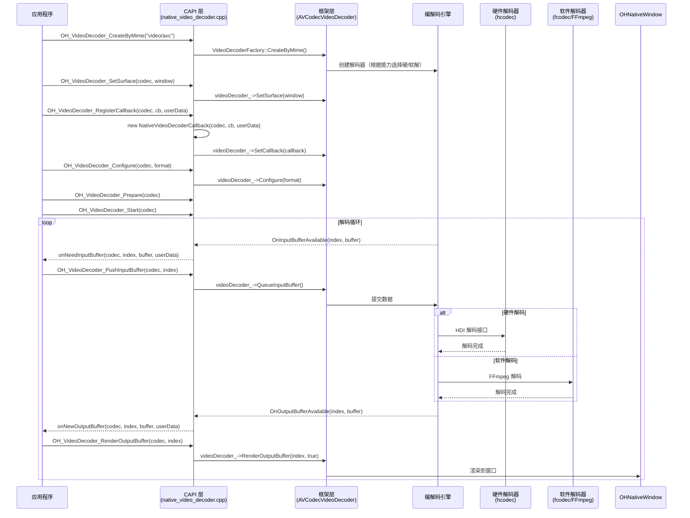
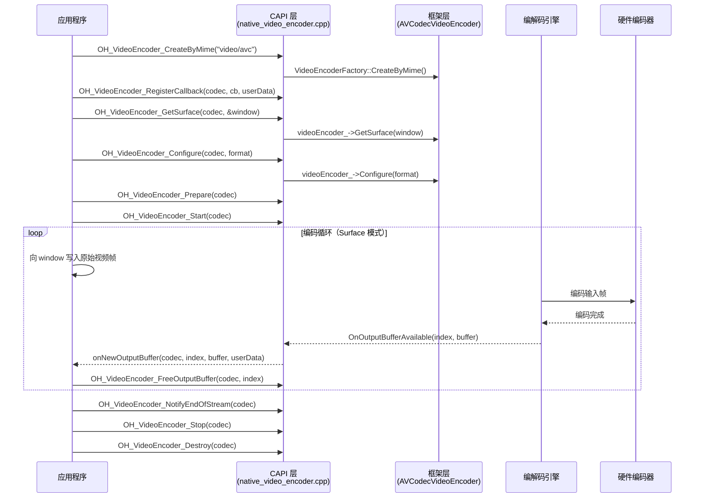
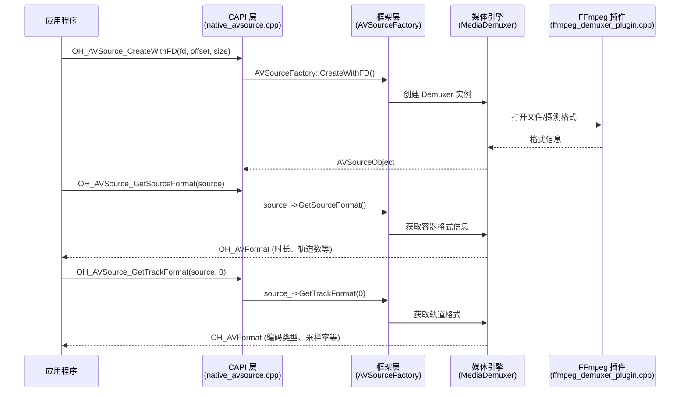
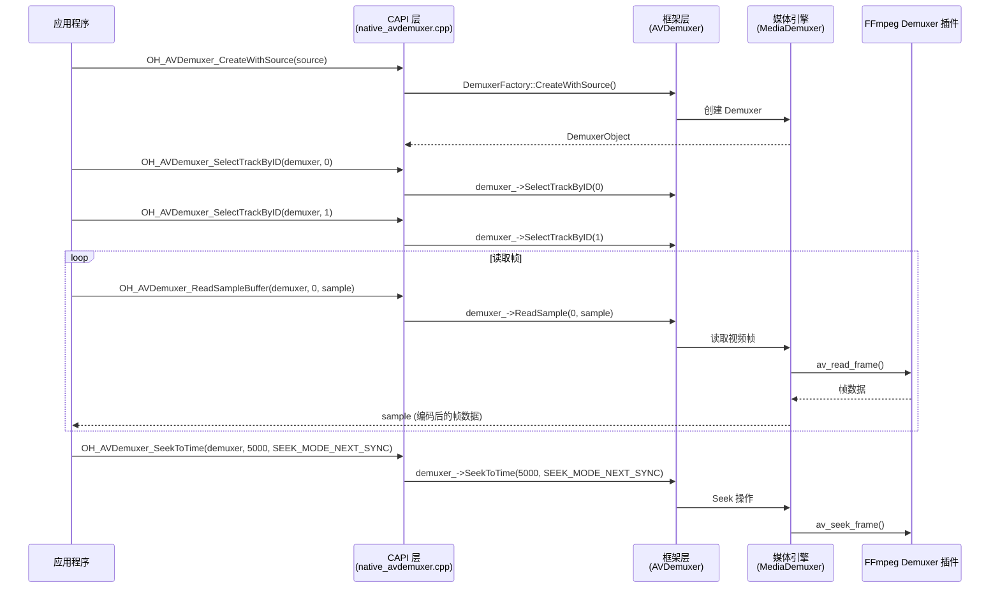
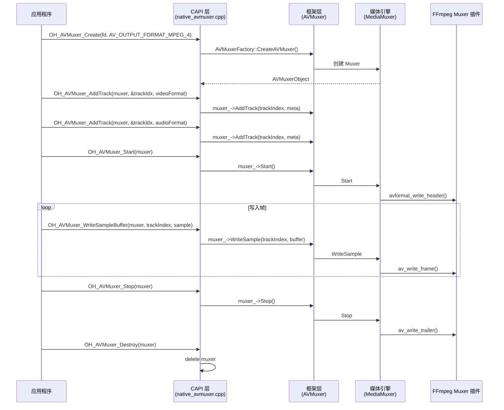
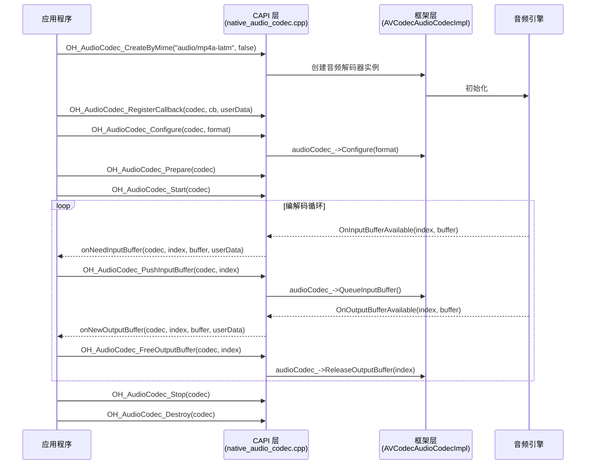

# multimedia_av_codec 模块 API 调用链流程

本文档描述从 C API 声明到 CAPI 实现、到 Framework 实现、到 Service 层的完整调用路径。

## 1. 音频解码器 (Audio Decoder)

### 1.1 创建实例

```
OH_AudioDecoder_CreateByMime(mime)
  -> frameworks/native/capi/avcodec/native_audio_decoder.cpp
  -> AudioDecoderFactory::CreateByMime(mime)
  -> interfaces/inner_api/native/avcodec_audio_decoder.h (AVCodecAudioDecoder)
  -> IPC -> Codec Engine (services/engine/codec/audio/)
```

### 1.2 配置与启动

```
OH_AudioDecoder_Configure(codec, format)
  -> AudioDecoderObject::audioDecoder_->Configure(format->format_)
  -> AVCodecAudioDecoder::Configure()

OH_AudioDecoder_Prepare(codec)
  -> AudioDecoderObject::audioDecoder_->Prepare()
  -> AVCodecAudioDecoder::Prepare()

OH_AudioDecoder_Start(codec)
  -> AudioDecoderObject::audioDecoder_->Start()
  -> AVCodecAudioDecoder::Start()
```

### 1.3 数据输入输出

```
OH_AudioDecoder_PushInputData(codec, index, attr)
  -> AudioDecoderObject::audioDecoder_->QueueInputBuffer(index, bufferInfo, bufferFlag)
  -> AVCodecAudioDecoder::QueueInputBuffer()

OH_AudioDecoder_FreeOutputData(codec, index)
  -> AudioDecoderObject::audioDecoder_->ReleaseOutputBuffer(index)
  -> AVCodecAudioDecoder::ReleaseOutputBuffer()

OH_AudioDecoder_GetOutputDescription(codec)
  -> AudioDecoderObject::audioDecoder_->GetOutputFormat(format)
  -> AVCodecAudioDecoder::GetOutputFormat()
```

### 1.4 回调设置

```
OH_AudioDecoder_SetCallback(codec, callback, userData)
  -> frameworks/native/capi/avcodec/native_audio_decoder.cpp
  -> new NativeAudioDecoder(codec, callback, userData) // 回调包装类
  -> AudioDecoderObject::audioDecoder_->SetCallback(audioDecObj->callback_)
```

回调转发路径:
```
AVCodecAudioDecoder::OnInputBufferAvailable(index, buffer)
  -> NativeAudioDecoder::OnInputBufferAvailable()
  -> OH_AVCodecOnNeedInputData(codec, index, data, userData)

AVCodecAudioDecoder::OnOutputBufferAvailable(index, info, flag, buffer)
  -> NativeAudioDecoder::OnOutputBufferAvailable()
  -> OH_AVCodecOnNewOutputData(codec, index, data, &bufferAttr, userData)

AVCodecAudioDecoder::OnError(errorType, errorCode)
  -> NativeAudioDecoder::OnError()
  -> AVCSErrorToOHAVErrCode(errorCode) // 错误码转换
  -> OH_AVCodecOnError(codec, extErr, userData)
```

### 1.5 音频解码器时序图



## 2. 视频解码器 (Video Decoder)

### 2.1 创建与配置

```
OH_VideoDecoder_CreateByMime(mime)
  -> frameworks/native/capi/avcodec/native_video_decoder.cpp
  -> VideoDecoderFactory::CreateByMime(mime)
  -> interfaces/inner_api/native/avcodec_video_decoder.h (AVCodecVideoDecoder)
  -> IPC -> Video Codec Engine (services/engine/codec/video/)
```

视频解码器特有的调用:

```
OH_VideoDecoder_SetSurface(codec, window)
  -> VideoDecoderObject::videoDecoder_->SetSurface(window)
  -> AVCodecVideoDecoder::SetSurface()
  -> 设置输出到 OHNativeWindow（Surface 模式）
```

### 2.2 数据输出

视频解码器有两种输出模式:

**Surface 模式（推荐）**:
```
OH_VideoDecoder_RenderOutputBuffer(codec, index)
  -> VideoDecoderObject::videoDecoder_->RenderOutputBuffer(index, true)
  -> 解码数据直接渲染到 Surface

OH_VideoDecoder_RenderOutputBufferAtTime(codec, index, renderTimestampNs)
  -> 指定时间戳渲染到 Surface
```

**Buffer 模式**:
```
OH_VideoDecoder_FreeOutputBuffer(codec, index)
  -> VideoDecoderObject::videoDecoder_->ReleaseOutputBuffer(index, false)
  -> 仅释放缓冲区，不渲染
```

### 2.3 视频解码器时序图



## 3. 音频/视频编码器

### 3.1 编码器调用链

```
OH_VideoEncoder_CreateByMime(mime)
  -> frameworks/native/capi/avcodec/native_video_encoder.cpp
  -> VideoEncoderFactory::CreateByMime(mime)
  -> interfaces/inner_api/native/avcodec_video_encoder.h (AVCodecVideoEncoder)
```

视频编码器特有调用:
```
OH_VideoEncoder_GetSurface(codec, &window)
  -> videoEncoder_->GetSurface(window)
  -> 获取输入 Surface（Surface 模式编码）

OH_VideoEncoder_NotifyEndOfStream(codec)
  -> videoEncoder_->NotifyEndOfStream()
  -> 通知编码器输入流结束（仅 Surface 模式）
```

### 3.2 编码器时序图



## 4. AVSource（媒体源）

### 4.1 创建调用链

```
OH_AVSource_CreateWithFD(fd, offset, size)
  -> frameworks/native/capi/avsource/native_avsource.cpp
  -> AVSourceFactory::CreateWithFD(fd, offset, size)
  -> interfaces/inner_api/native/avsource.h (AVSource)
  -> services/media_engine/modules/demuxer/ (媒体引擎 Demuxer 模块)

OH_AVSource_CreateWithURI(uri)
  -> AVSourceFactory::CreateWithURI(uri)
  -> 检查 NetworkSecurityConfig HTTP 明文策略
  -> 创建媒体源

OH_AVSource_CreateWithDataSource(dataSource)
  -> NativeAVDataSource(dataSource)  // 包装用户自定义数据源
  -> AVSourceFactory::CreateWithDataSource()
```

### 4.2 格式查询

```
OH_AVSource_GetSourceFormat(source)
  -> AVSourceObject::source_->GetSourceFormat()
  -> AVSource::GetSourceFormat()

OH_AVSource_GetTrackFormat(source, trackIndex)
  -> AVSourceObject::source_->GetTrackFormat(trackIndex)
  -> AVSource::GetTrackFormat()
```

### 4.3 AVSource 时序图



## 5. AVDemuxer（解封装器）

### 5.1 调用链

```
OH_AVDemuxer_CreateWithSource(source)
  -> frameworks/native/capi/avdemuxer/native_avdemuxer.cpp
  -> DemuxerFactory::CreateWithSource(sourceObj->source_)
  -> interfaces/inner_api/native/avdemuxer.h (AVDemuxer)
```

### 5.2 读取与 Seek

```
OH_AVDemuxer_SelectTrackByID(demuxer, trackIndex)
  -> DemuxerObject::demuxer_->SelectTrackByID(trackIndex)

OH_AVDemuxer_ReadSampleBuffer(demuxer, trackIndex, sample)
  -> DemuxerObject::demuxer_->ReadSample(trackIndex, sample)

OH_AVDemuxer_SeekToTime(demuxer, millisecond, mode)
  -> DemuxerObject::demuxer_->SeekToTime(millisecond, mode)
```

### 5.3 Demuxer 时序图



## 6. AVMuxer（封装器）

### 6.1 调用链

```
OH_AVMuxer_Create(fd, format)
  -> frameworks/native/capi/avmuxer/native_avmuxer.cpp
  -> AVMuxerFactory::CreateAVMuxer(fd, format)
  -> interfaces/inner_api/native/avmuxer.h (AVMuxer)

OH_AVMuxer_SetRotation(muxer, rotation)
  -> Meta(Tag::VIDEO_ROTATION) -> muxer_->SetParameter(param)

OH_AVMuxer_AddTrack(muxer, &trackIndex, trackFormat)
  -> AVMuxerObject::muxer_->AddTrack(trackIndex, meta)

OH_AVMuxer_WriteSampleBuffer(muxer, trackIndex, sample)
  -> AVMuxerObject::muxer_->WriteSample(trackIndex, buffer)
```

### 6.2 Muxer 时序图



## 7. 编解码能力查询 (Capability)

### 7.1 调用链

```
OH_AVCodec_GetCapability(mime, isEncoder)
  -> frameworks/native/capi/common/native_avcapability.cpp
  -> AVCodecListFactory::CreateAVCodecList()
  -> codeclist->GetCapability(mime, isEncoder, AVCODEC_NONE)
  -> interfaces/inner_api/native/avcodec_list.h (AVCodecList)
  -> IPC -> Codec List Service
```

能力查询接口直接读取 `OH_AVCapability` 内部的 `CapabilityData` 结构，无需额外 IPC 调用:
```
OH_AVCapability_IsHardware(capability)    -> 读取 capabilityData_.isHardware_
OH_AVCapability_GetName(capability)       -> 读取 capabilityData_.codecName
OH_AVCapability_GetEncoderBitrateRange()  -> 读取 capabilityData_.bitrateRange
OH_AVCapability_GetVideoWidthRange()      -> 读取 capabilityData_.width
```

## 8. CencInfo (DRM)

### 8.1 调用链

```
OH_AVCencInfo_Create()
  -> frameworks/native/capi/avcencinfo/native_cencinfo.cpp
  -> new OH_AVCencInfo()  // 直接结构体，无 Framework 层

OH_AVCencInfo_SetAlgorithm(cencInfo, algo)
  -> 设置 cencInfo_->algo (DrmCencAlgorithm 枚举)

OH_AVCencInfo_SetKeyIdAndIv(cencInfo, keyId, keyIdLen, iv, ivLen)
  -> 设置 cencInfo_ 的 keyId 和 iv 字段

OH_AVCencInfo_SetSubSampleInfo(cencInfo, encryptedBlockCount, skippedBlockCount, ...)
  -> 设置 cencInfo_ 的 subSamples/clearHeaderLen/payLoadLen

OH_AVCencInfo_SetAVBuffer(cencInfo, buffer)
  -> 将 CencInfo 附加到 OH_AVBuffer 的 Meta 中
```

## 9. 统一音频编解码器 (AudioCodec, since 11)

### 9.1 调用链

AudioCodec 是 AudioDecoder 和 AudioEncoder 的统一替代接口:

```
OH_AudioCodec_CreateByMime(mime, isEncoder)
  -> frameworks/native/capi/avcodec/native_audio_codec.cpp
  -> AVCodecAudioCodecImpl
  -> 根据 isEncoder 参数决定创建编码器或解码器

OH_AudioCodec_RegisterCallback(codec, callback, userData)
  -> 使用新的 OH_AVCodecCallback（OH_AVBuffer 模式，非 OH_AVMemory）
```

### 9.2 AudioCodec 时序图



## 10. 同步模式调用链 (since 20)

同步模式通过 `OH_MD_KEY_ENABLE_SYNC_MODE` 配置启用，不设置回调，而是使用 Query/Get 接口:

```
OH_VideoDecoder_QueryInputBuffer(codec, &index, timeoutUs)
  -> videoDecoder_->QueryInputBuffer(index, timeoutUs)
  -> 返回可用的输入缓冲区索引

OH_VideoDecoder_GetInputBuffer(codec, index)
  -> videoDecoder_->GetInputBuffer(index)
  -> 返回 OH_AVBuffer 指针

OH_VideoDecoder_QueryOutputBuffer(codec, &index, timeoutUs)
  -> videoDecoder_->QueryOutputBuffer(index, timeoutUs)
  -> 返回可用的输出缓冲区索引

OH_VideoDecoder_GetOutputBuffer(codec, index)
  -> videoDecoder_->GetOutputBuffer(index)
  -> 返回 OH_AVBuffer 指针
```
