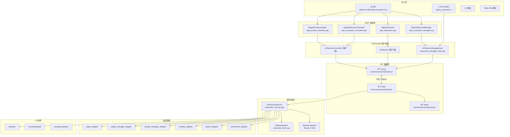
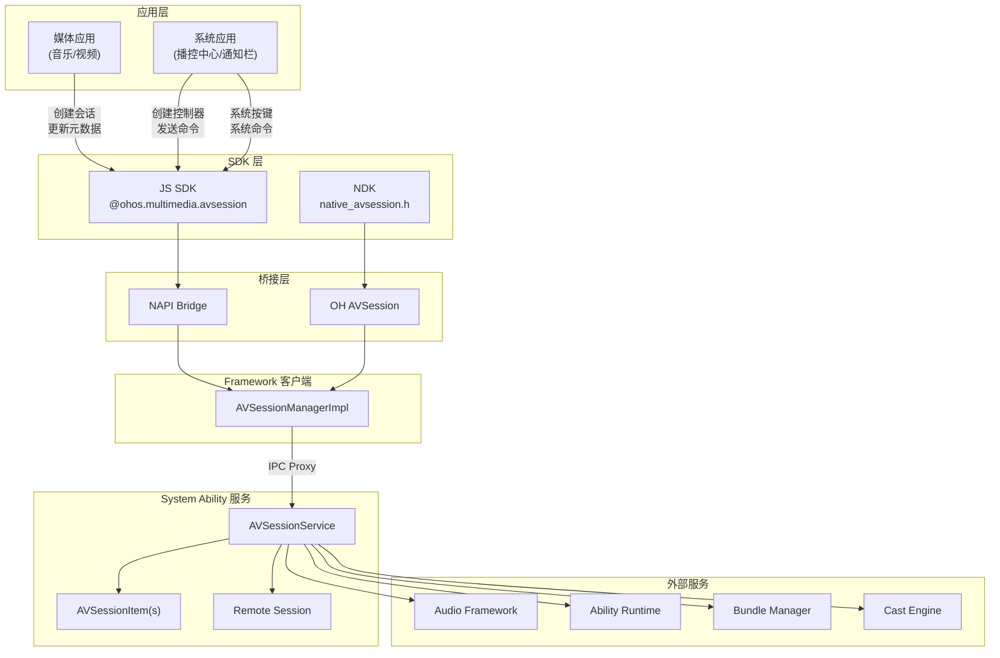
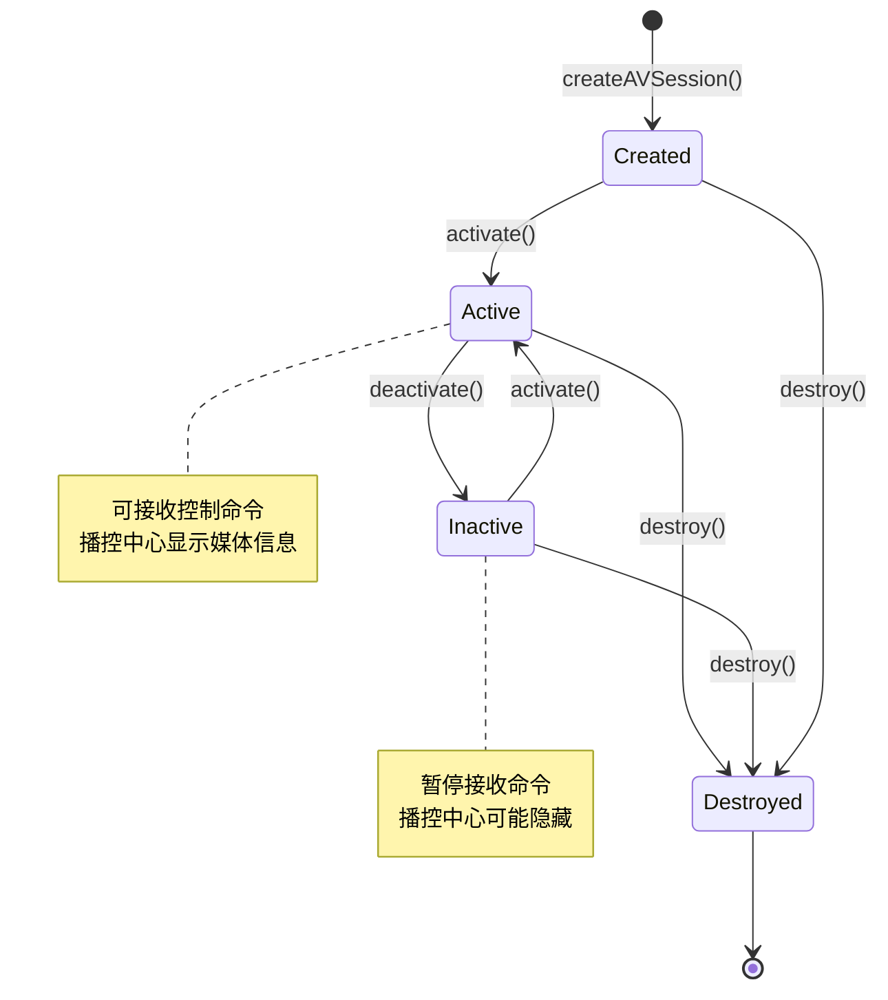

# multimedia_av_session 架构总览

## 模块职责

multimedia_av_session（AVSession 部件）为鸿蒙操作系统提供**统一的媒体会话控制能力**。其核心职责包括：

1. **媒体会话管理**：为音视频应用提供标准化的会话创建、激活、销毁全生命周期管理，使应用能够将其播放状态和媒体元数据注册到系统层面。
2. **系统播控中心集成**：应用创建会话后，系统播控中心（Media Control Panel）可获取当前播放信息（标题、艺术家、专辑封面、进度等），并向应用下发播放控制命令（播放、暂停、上一首、下一首、快进、快退、seek 等）。
3. **跨应用媒体控制**：通过 AVSessionController 机制，系统应用（如通知中心、锁屏、语音助手）可以查询和控制任意已注册的媒体会话。
4. **音频投播（Cast+）**：支持将本端媒体会话投播到远端设备，包含设备发现、连接建立、媒体传输和远端控制的完整流程。此功能需要编译宏 `CASTPLUS_CAST_ENGINE_ENABLE` 开启。
5. **分布式会话**：支持跨设备会话同步，包含 RemoteSessionSource（源端）和 RemoteSessionSink（宿端），实现媒体会话的跨设备迁移和控制。
6. **桌面歌词**：为音乐类应用提供桌面歌词显示能力的支持查询和控制。

**模块边界**：
- AVSession 只负责媒体会话的注册、信息传递和控制命令转发，**不直接处理媒体解码、渲染或音频输出**。
- 音频输出路由由 audio_framework 负责，AVSession 通过 audio_adapter 与之交互。
- 应用启动（点击媒体通知时拉起 Ability）由 ability_runtime 负责，AVSession 通过 ability_manager_adapter 与之交互。

源文件参考：
- 模块根目录：`multimedia_av_session/`
- 公共头文件：`multimedia_av_session/interfaces/inner_api/native/session/include/avsession_manager.h`
- 错误码定义：`multimedia_av_session/interfaces/inner_api/native/session/include/avsession_errors.h`

---

## 组件层次

### 1. JS API 层

提供面向 JS/TS 开发者的公开接口，声明文件为 `@ohos.multimedia.avsession.d.ts`。

- **源文件**：`api/interface_sdk-js/api/@ohos.multimedia.avsession.d.ts`
- **职责**：定义所有公开的 JS 接口类型、枚举、接口签名，是应用开发者的直接编程接口。
- **关键类型**：`avSession`（Manager 命名空间）、`AVSession`（会话实例）、`AVSessionController`（控制器实例）、`AVCastController`（投播控制器）、`AVSessionDescriptor`、`AVMetadata`、`AVPlaybackState` 等。

### 2. NAPI 桥接层

将 JS 调用映射为 C++ 方法调用，实现 JS 对象与 C++ 对象的双向转换。

- **源文件目录**：`multimedia_av_session/frameworks/js/napi/session/`
- **头文件**：`multimedia_av_session/frameworks/js/napi/session/include/`
  - `napi_avsession_manager.h` — Manager 级 NAPI 封装
  - `napi_avsession.h` — AVSession 实例 NAPI 封装
  - `napi_avsession_controller.h` — AVSessionController 实例 NAPI 封装
  - `napi_avcast_controller.h` — AVCastController 实例 NAPI 封装
- **源文件**：`multimedia_av_session/frameworks/js/napi/session/src/`
  - `napi_avsession_manager.cpp` — Manager 级方法实现（CreateAVSession, CastAudio, SendSystemAVKeyEvent 等）
  - `napi_avsession.cpp` — AVSession 实例方法实现（SetAVMetaData, Activate, Destroy 等）
  - `napi_avsession_controller.cpp` — Controller 实例方法实现（SendControlCommand, GetAVMetaData 等）
- **职责**：
  - JS 值（napi_value）到 C++ 对象的序列化/反序列化
  - Promise/Callback 异步模式的适配
  - 事件监听（on/off）的注册与回调分发
  - 参数校验和错误码转换

### 3. Framework 客户端层

C++ 客户端实现，持有 IPC Proxy，向服务端转发请求。

- **源文件**：`multimedia_av_session/frameworks/native/session/src/avsession_manager_impl.cpp`
- **头文件**：`multimedia_av_session/interfaces/inner_api/native/session/include/`
  - `avsession_manager.h` — 客户端 Manager 接口
  - `av_session.h` — 客户端 AVSession 接口
  - `avsession_controller.h` — 客户端 Controller 接口
  - `avsession_errors.h` — 错误码定义
- **职责**：
  - 实现 `AVSessionManager` 单例，提供全局入口
  - 持有服务端 IPC Proxy（`AVSessionServiceProxy`）
  - 封装 IPC 调用细节（序列化请求数据、反序列化响应数据）
  - 管理本地回调注册和事件分发

### 4. C API (NDK) 层

提供面向 C/C++ 开发者的 NDK 接口。

- **头文件**：`multimedia_av_session/interfaces/kits/c/`
  - `native_avsession.h` — C API 声明
  - `native_avsession_errors.h` — C API 错误码定义
- **实现**：`multimedia_av_session/frameworks/native/ohavsession/`
- **职责**：为不需要 JS 运行时的 C/C++ 应用提供会话控制能力。

### 5. IPC 通信层

实现客户端-服务端之间的跨进程通信。

- **源文件目录**：`multimedia_av_session/services/session/ipc/`
  - `base/` — IPC 基础定义（消息码、序列化辅助）
  - `proxy/` — 客户端代理（`AVSessionServiceProxy`）
  - `stub/` — 服务端桩（`AVSessionServiceStub`）
- **职责**：定义 IPC 消息协议，封装 Parcel 序列化/反序列化。

### 6. 服务端层

System Ability (SA) 服务实现，管理系统中所有媒体会话。

- **源文件目录**：`multimedia_av_session/services/session/server/`
- **核心组件**：
  - `avsession_service.cpp` — AVSessionService SA 主入口
    - 源文件：`multimedia_av_session/services/session/server/avsession_service.cpp`
    - 职责：会话的创建/销毁/查询、系统命令分发、设备投播管理、会话优先级调度
  - `avsession_item.cpp` — AVSessionItem 服务端会话记录
    - 源文件：`multimedia_av_session/services/session/server/avsession_item.cpp`
    - 职责：单个会话的元数据存储、播放状态管理、控制命令接收与回调触发
  - `remote/` — 分布式会话
    - `RemoteSessionSource` — 源端会话控制
    - `RemoteSessionSink` — 宿端会话接收
    - 职责：跨设备会话同步，实现分布式媒体控制

### 7. 适配器层

封装对其他子系统服务的调用。

- **源文件目录**：`multimedia_av_session/services/session/adapter/`
- **适配器组件**：
  - `audio_adapter` — 音频框架适配，与 audio_framework 交互
  - `ability_manager_adapter` — Ability 管理适配，与 ability_runtime 交互
  - `bundle_manager_adapter` — 包管理适配
  - `window_adapter` — 窗口管理适配
  - `power_adapter` — 电源管理适配
  - `permission_adapter` — 权限校验适配
- **职责**：隔离外部子系统依赖，便于测试和平台移植。

### 8. UI 组件层

提供系统级 UI 组件。

- **avpicker/** — 投播设备选择器 UI 组件
- **avvolumepanel/** — 音量面板 UI 组件
- **avinputcastpicker/** — 输入投播选择器 UI 组件

### 9. SA 配置

- **sa_profile/** — System Ability 注册配置，声明 AVSessionService 的 SA ID 和加载策略。

### 10. 辅助模块

- **utils/** — `avsession_utils`，提供日志、字符串处理等公共工具函数。
- **common/** — 框架公共代码，包含通用数据结构和常量定义。
- **cj/** — CJ 语言绑定实现。
- **taihe/** — Taihe IDL 绑定实现。

---

## 依赖关系

### 内部依赖关系

### 外部依赖

| 外部子系统 | 交互方式 | 用途 |
|-----------|---------|------|
| audio_framework | audio_adapter | 音频焦点管理、音频输出设备查询、音量控制 |
| ability_runtime | ability_manager_adapter | 点击媒体通知时启动对应 Ability |
| bundle_framework | bundle_manager_adapter | 查询应用信息（bundleName、abilityName） |
| window_manager | window_adapter | 窗口状态查询（前台/后台） |
| power_manager | power_adapter | 屏幕亮灭状态监听 |
| access_token | permission_adapter | 权限校验（ohos.permission.MANAGE_MEDIA_RESOURCES 等） |
| distributed_hardware | RemoteSession | 分布式设备发现和会话同步 |
| cast_engine | CastController | 投播控制（需 CASTPLUS_CAST_ENGINE_ENABLE 宏） |

---

## 架构层次总览

---

## 会话生命周期

一个典型的媒体应用会话流程：
1. 应用调用 `avSession.createAVSession()` 创建会话（进入 Created 状态）
2. 调用 `session.setAVMetadata()` 设置媒体元数据
3. 调用 `session.setAVPlaybackState()` 设置播放状态
4. 调用 `session.activate()` 激活会话（进入 Active 状态）
5. 播控中心监听到 `sessionCreate` 事件，创建对应的 `AVSessionController`
6. 用户在播控中心操作时，通过 Controller 发送控制命令
7. 应用通过 `session.on('play'|'pause'|...)` 回调接收命令并执行
8. 应用退出时调用 `session.destroy()` 销毁会话
