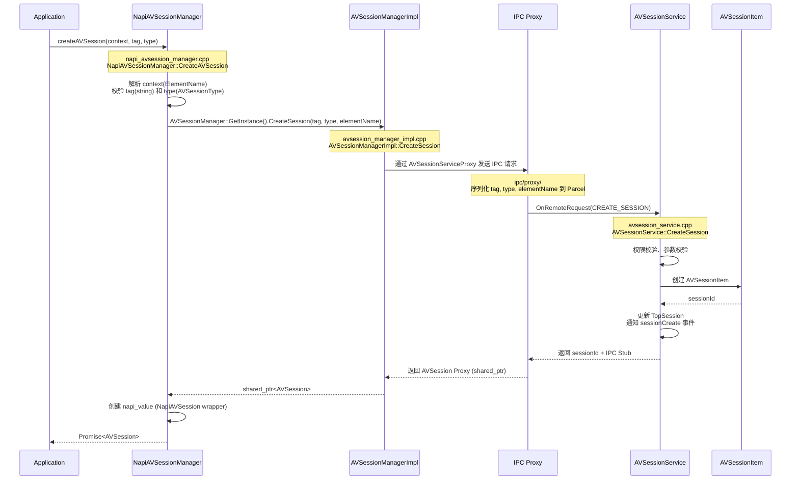
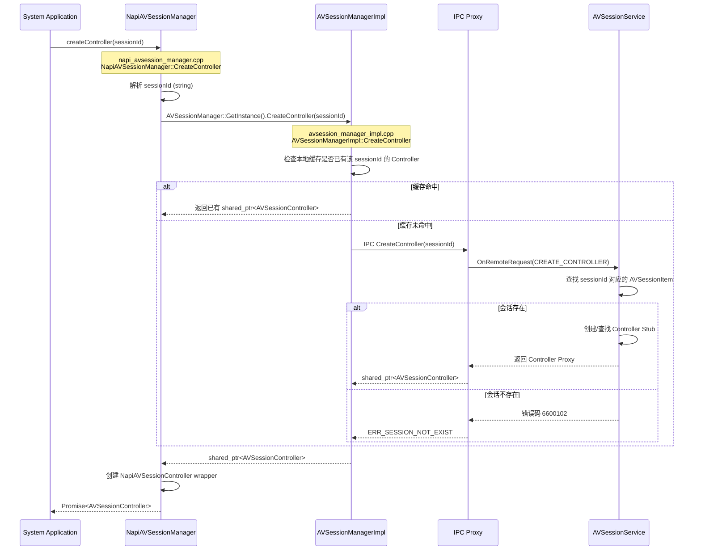
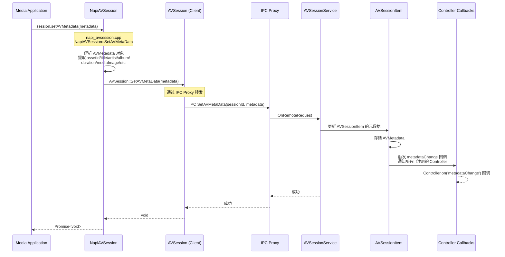
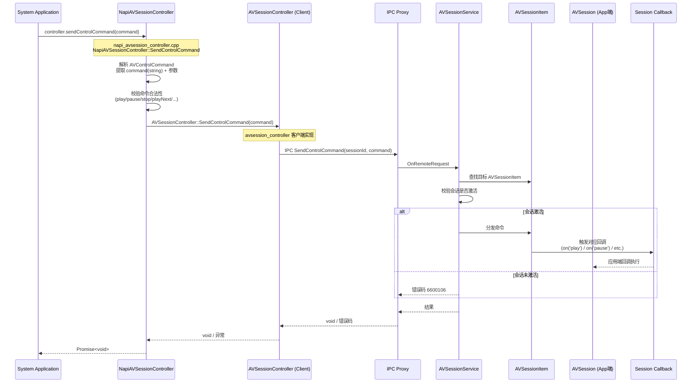
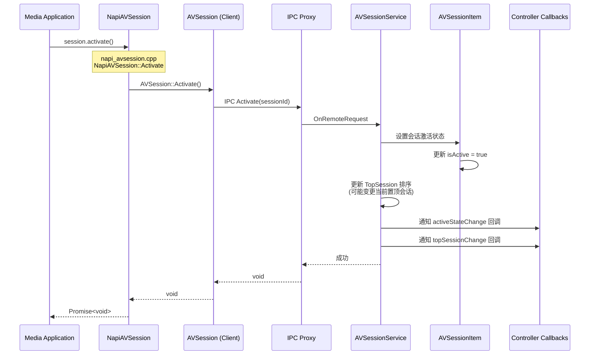
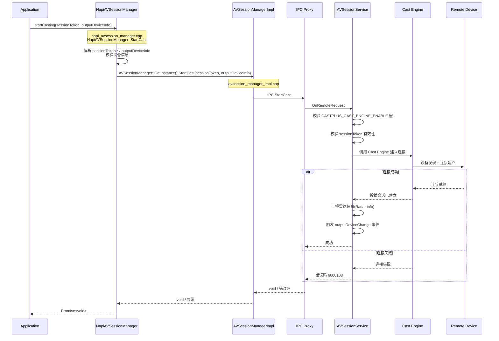
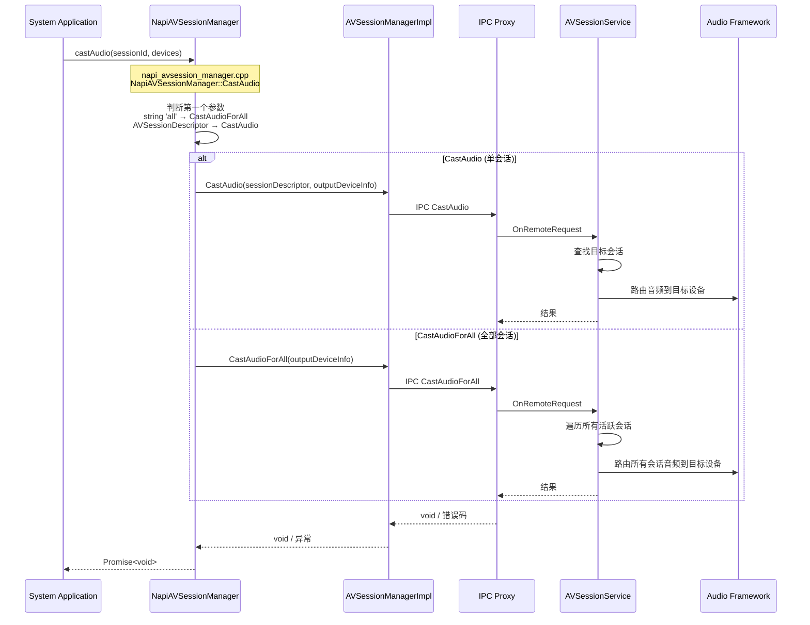
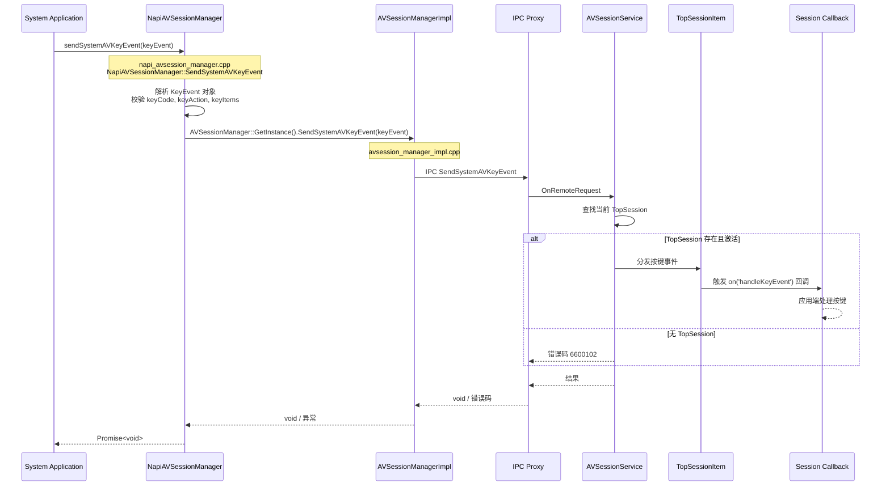
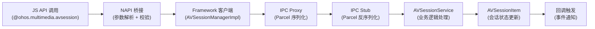

# API 调用链流程

本文档描述从 JS API 声明到 NAPI 桥接层再到 C++ 实现的完整调用路径。选取 8 个核心 API 进行详细分析。

---

## 1. avSession.createAVSession — 会话创建

创建媒体会话，是所有媒体控制功能的前置操作。

### 调用链路

### 参数传递

| 参数 | JS 类型 | NAPI 转换 | C++ 类型 | 说明 |
|------|---------|----------|---------|------|
| context | Context | 提取 ElementName (bundleName/abilityName) | AppExecFwk::ElementName | 标识会话所属应用 |
| tag | string | napi_get_value_string_utf8 | std::string | 会话标签，用于调试 |
| type | AVSessionType | 枚举映射 | AVSessionType | audio / video |

### 返回值处理
- NAPI 层将 C++ `shared_ptr<AVSession>` 包装为 JS `AVSession` 对象并 resolve Promise。
- 如果会话已存在相同 tag，可能返回已有实例（取决于服务端策略）。
- 失败时 reject 对应错误码（6600101 服务异常、401 参数错误）。

### 源文件引用
- JS 声明：`api/interface_sdk-js/api/@ohos.multimedia.avsession.d.ts`
- NAPI 入口：`multimedia_av_session/frameworks/js/napi/session/src/napi_avsession_manager.cpp` (NapiAVSessionManager::CreateAVSession)
- 客户端实现：`multimedia_av_session/frameworks/native/session/src/avsession_manager_impl.cpp` (AVSessionManagerImpl::CreateSession)
- 服务端实现：`multimedia_av_session/services/session/server/avsession_service.cpp` (AVSessionService::CreateSession)

---

## 2. avSession.createController — 控制器创建

系统应用根据 sessionId 创建会话控制器，用于向目标会话发送控制命令。

### 调用链路

### 参数传递

| 参数 | JS 类型 | NAPI 转换 | C++ 类型 | 说明 |
|------|---------|----------|---------|------|
| sessionId | string | napi_get_value_string_utf8 | std::string | 目标会话的唯一标识 |

### 关键行为
- 若本地已有该 sessionId 的 Controller 实例，返回已有的 `RepeatedInstance`，避免重复创建。
- 需要 `ohos.permission.MANAGE_MEDIA_RESOURCES` 权限。
- 若会话不存在，抛出 6600102 错误。

### 源文件引用
- NAPI 入口：`multimedia_av_session/frameworks/js/napi/session/src/napi_avsession_manager.cpp` (NapiAVSessionManager::CreateController)
- 客户端实现：`multimedia_av_session/frameworks/native/session/src/avsession_manager_impl.cpp` (AVSessionManagerImpl::CreateController)

---

## 3. avsession.setAVMetadata — 元数据设置

应用通过 AVSession 实例设置当前播放媒体的元数据信息。

### 调用链路

### 参数传递

| 字段 | JS 类型 | 说明 |
|------|---------|------|
| assetId | string | 媒体资源 ID |
| title | string | 标题 |
| artist | string | 艺术家 |
| album | string | 专辑名 |
| writer | string | 词作者 |
| composer | string | 作曲者 |
| duration | number | 时长（毫秒） |
| mediaImage | string / PixelMap | 封面图片 |
| subtitle | string | 副标题 |
| description | string | 描述 |
| lyric | string | 歌词内容 |
| previousAssetId | string | 上一首资源 ID |
| nextAssetId | string | 下一首资源 ID |

### 关键行为
- 设置元数据后，所有持有该会话 Controller 的系统应用会收到 `metadataChange` 事件。
- 需要会话处于有效（未销毁）状态。
- 失败时可能返回 6600101（服务异常）或 6600102（会话不存在）。

### 源文件引用
- NAPI 入口：`multimedia_av_session/frameworks/js/napi/session/src/napi_avsession.cpp` (NapiAVSession::SetAVMetaData)
- 客户端接口：`multimedia_av_session/interfaces/inner_api/native/session/include/av_session.h` (AVSession::SetAVMetaData)

---

## 4. controller.sendControlCommand — 发送控制命令

系统应用通过 Controller 向目标会话发送媒体控制命令。

### 调用链路

### 支持的控制命令

| 命令 | 参数 | 说明 |
|------|------|------|
| play | - | 播放 |
| pause | - | 暂停 |
| stop | - | 停止 |
| playNext | - | 下一首 |
| playPrevious | - | 上一首 |
| fastForward | - | 快进 |
| rewind | - | 快退 |
| seek | number (ms) | 跳转到指定位置 |
| setSpeed | number | 设置播放速度 |
| setLoopMode | LoopMode | 设置循环模式 |
| toggleFavorite | - | 收藏/取消收藏 |

### 关键行为
- 命令发送前需检查目标会话是否激活（6600106）。
- 不支持的命令会返回 6600105。
- 命令过载时返回 6600107。
- 需要 `ohos.permission.MANAGE_MEDIA_RESOURCES` 权限。

### 源文件引用
- NAPI 入口：`multimedia_av_session/frameworks/js/napi/session/src/napi_avsession_controller.cpp` (NapiAVSessionController::SendControlCommand)
- 客户端接口：`multimedia_av_session/interfaces/inner_api/native/session/include/avsession_controller.h` (AVSessionController::SendControlCommand)

---

## 5. avsession.activate — 会话激活

激活媒体会话，激活后才能接收控制命令，播控中心才会显示该会话。

### 调用链路

### 关键行为
- 激活后服务端更新会话优先级排序，可能触发 `topSessionChange` 事件。
- 所有持有该会话 Controller 的应用会收到 `activeStateChange` 回调。
- 同一时间系统可能存在多个激活会话，但 TopSession 只有一个。
- 如果会话已销毁，返回 6600102。

### 源文件引用
- NAPI 入口：`multimedia_av_session/frameworks/js/napi/session/src/napi_avsession.cpp` (NapiAVSession::Activate)
- 服务端处理：`multimedia_av_session/services/session/server/avsession_service.cpp`

---

## 6. avSession.startCasting — 投播启动

将媒体会话投播到指定远端设备。需要 `CASTPLUS_CAST_ENGINE_ENABLE` 编译宏。

### 调用链路

### 参数传递

| 参数 | JS 类型 | 说明 |
|------|---------|------|
| sessionToken | AVSessionToken | 包含 sessionId 和 elementName |
| outputDeviceInfo | OutputDeviceInfo | 目标设备信息列表 |

### 关键行为
- 必须先通过 `startCastDeviceDiscovery` 发现设备并选择目标设备。
- 投播成功后可通过 `getAVCastController` 获取投播控制器进行远端控制。
- 包含雷达信息上报逻辑，用于使用统计。
- 设备连接失败时返回 6600108。

### 源文件引用
- NAPI 入口：`multimedia_av_session/frameworks/js/napi/session/src/napi_avsession_manager.cpp` (NapiAVSessionManager::StartCast)
- 客户端实现：`multimedia_av_session/frameworks/native/session/src/avsession_manager_impl.cpp` (AVSessionManagerImpl::StartCast)

---

## 7. avSession.castAudio — 音频投播

将音频会话投播到指定设备，支持单个会话和全部会话投播。

### 调用链路

### 参数传递

| 参数 | JS 类型 | NAPI 分支 | 说明 |
|------|---------|----------|------|
| 第一个参数 | 'all' / AVSessionDescriptor | 决定调用 CastAudioForAll 或 CastAudio | 投播范围 |
| devices | OutputDeviceInfo | 统一转换 | 目标设备信息 |

### 关键行为
- `castAudio` 有两种模式：单会话投播和全部投播。
- 第一个参数传入字符串 `'all'` 时触发全部投播模式（CastAudioForAll）。
- 需要 `ohos.permission.MANAGE_MEDIA_RESOURCES` 系统权限。
- 设备连接失败时返回 6600108。

### 源文件引用
- NAPI 入口：`multimedia_av_session/frameworks/js/napi/session/src/napi_avsession_manager.cpp` (NapiAVSessionManager::CastAudio)
- 客户端实现：`multimedia_av_session/frameworks/native/session/src/avsession_manager_impl.cpp` (AVSessionManagerImpl::CastAudio / CastAudioForAll)

---

## 8. avSession.sendSystemAVKeyEvent — 系统按键事件

系统应用将媒体按键事件（如蓝牙耳机按键、物理按键）发送到当前置顶会话。

### 调用链路

### 参数传递

| 字段 | JS 类型 | 说明 |
|------|---------|------|
| keyCode | number | 按键码 |
| keyAction | number | 按键动作（down/up） |
| keyItems | Array<KeyItem> | 按键项列表（包含按下的键、修饰键等） |

### 关键行为
- 按键事件发送到当前 TopSession（置顶会话），不是指定会话。
- 需要校验 keyEvent 的有效性，包含 keyCode、keyAction、keyItems 的完整校验。
- 需要 `ohos.permission.MANAGE_MEDIA_RESOURCES` 系统权限。
- 如果 TopSession 未注册 `handleKeyEvent` 回调，按键事件将被丢弃。

### 源文件引用
- NAPI 入口：`multimedia_av_session/frameworks/js/napi/session/src/napi_avsession_manager.cpp` (NapiAVSessionManager::SendSystemAVKeyEvent)
- 客户端实现：`multimedia_av_session/frameworks/native/session/src/avsession_manager_impl.cpp` (AVSessionManagerImpl::SendSystemAVKeyEvent)

---

## 调用链通用模式

所有 API 调用均遵循以下通用模式：

### 各层职责总结

| 层次 | 职责 | 关键文件 |
|------|------|---------|
| JS API | 接口类型定义 | `api/interface_sdk-js/api/@ohos.multimedia.avsession.d.ts` |
| NAPI Bridge | JS/C++ 类型转换、参数校验、异步模式适配 | `frameworks/js/napi/session/src/napi_avsession_manager.cpp` |
| Framework Client | IPC Proxy 管理、本地缓存、回调注册 | `frameworks/native/session/src/avsession_manager_impl.cpp` |
| IPC | 跨进程通信、序列化/反序列化 | `services/session/ipc/proxy/`、`services/session/ipc/stub/` |
| Service | 会话生命周期管理、优先级调度、事件分发 | `services/session/server/avsession_service.cpp` |
| SessionItem | 单会话状态存储、命令接收、回调触发 | `services/session/server/avsession_item.cpp` |
