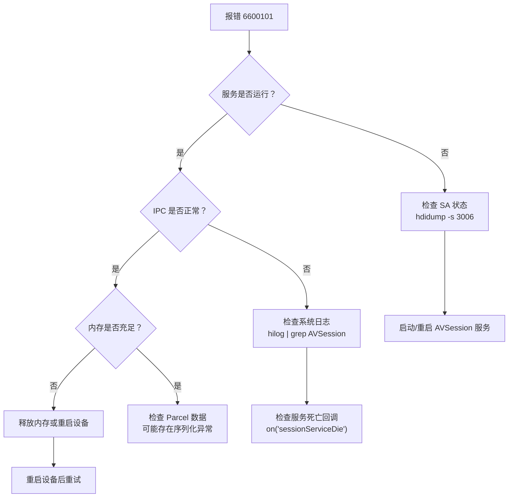

# 故障排查指南

本文档按错误类别组织 multimedia_av_session 模块的常见故障场景、错误码含义和排查思路。

> 错误码定义源文件：
> - 会话错误码（6600xxx）：`multimedia_av_session/interfaces/inner_api/native/session/include/avsession_errors.h`
> - 投播错误码（661xxxx）：`multimedia_av_session/api/interface_sdk_c/multimedia/av_session/native_avsession_errors.h`
> - 错误码文档：`multimedia_av_session/error_doc/errorcode-avsession.md`

---

## 一、通用错误（201 / 202 / 401）

### 错误码 201 — 权限拒绝 (Permission denied)

**含义**：调用方缺少所需权限。

**触发场景**：
- 系统应用调用 `createController`、`sendSystemAVKeyEvent`、`sendSystemControlCommand` 等接口时，未在配置文件中声明 `ohos.permission.MANAGE_MEDIA_RESOURCES` 权限。
- 非系统签名应用尝试调用需要系统权限的接口。

**排查步骤**：
1. 检查 `module.json5`（或 `config.json`）中是否声明了所需权限。
2. 确认应用是否为系统签名应用（部分接口仅限系统应用）。
3. 检查 `ohos.permission.MANAGE_MEDIA_RESOURCES` 是否在权限列表中。

**典型修复**：
```json
// module.json5
{
  "requestPermissions": [
    {
      "name": "ohos.permission.MANAGE_MEDIA_RESOURCES"
    }
  ]
}
```

**源文件**：`interfaces/inner_api/native/session/include/avsession_errors.h`

---

### 错误码 202 — 非系统应用 (Caller is not a system application)

**含义**：调用方不是系统应用，无权调用系统 API。

**触发场景**：
- 普通三方应用调用了 `getAllSessionDescriptors`、`createController`、`castAudio` 等标记为系统 API 的接口。

**排查步骤**：
1. 确认当前应用是否具有系统签名。
2. 检查 API 文档中该接口是否标记为"系统接口"。
3. 如果是三方应用，改用公开 API（如 `createAVSession`、`setAVMetadata` 等）。

**源文件**：`interfaces/inner_api/native/session/include/avsession_errors.h`

---

### 错误码 401 — 参数错误 (Parameter error)

**含义**：传入参数无效。

**触发场景**：
- `createAVSession(context, tag, type)` 中 tag 为空字符串或 type 不是有效枚举值。
- `sendControlCommand` 中 command 不是合法的 AVControlCommand。
- `seek` 命令缺少 position 参数。
- 必填参数缺失或类型不匹配。

**排查步骤**：
1. 逐一检查 API 调用时传入的每个参数类型是否匹配接口定义。
2. 确认必填参数是否全部提供。
3. 确认枚举值是否在合法范围内。
4. 查看 NAPI 层的参数校验日志（`napi_avsession_manager.cpp`、`napi_avsession.cpp`、`napi_avsession_controller.cpp`）。

**源文件**：`interfaces/inner_api/native/session/include/avsession_errors.h`

---

## 二、会话服务错误（6600xxx）

### 错误码 6600101 — 会话服务异常 (Session service exception)

**含义**：会话服务端异常，客户端无法获取服务端的消息响应。

**触发场景**：
1. AVSession System Ability 未运行或尚未启动完成。
2. 客户端与服务端的 IPC 连接中断。
3. 服务端在重启过程中被杀。
4. 系统内存不足导致 ERR_NO_MEMORY。
5. IPC 序列化/反序列化失败（Parcel 数据异常）。

**排查步骤**：



1. 使用 `hdidump` 检查 AVSession SA（SA ID 通常为 3006）是否在运行。
2. 查看 `hilog` 日志中 AVSession 相关的 ERROR 级别日志。
3. 注册 `sessionServiceDie` 事件监听，在服务死亡时收到通知。
4. 如果是偶发错误，可实现重试逻辑（建议超时 3s）。
5. 如果持续失败，销毁当前会话/控制器并重新创建。

**典型修复**：
```javascript
// 重试逻辑示例
async function createSessionWithRetry(context, tag, type, maxRetries = 3) {
  for (let i = 0; i < maxRetries; i++) {
    try {
      return await avSession.createAVSession(context, tag, type);
    } catch (err) {
      if (err.code === 6600101 && i < maxRetries - 1) {
        await new Promise(resolve => setTimeout(resolve, 1000));
        continue;
      }
      throw err;
    }
  }
}
```

**源文件**：
- 错误定义：`interfaces/inner_api/native/session/include/avsession_errors.h`
- 服务端实现：`services/session/server/avsession_service.cpp`
- 客户端实现：`frameworks/native/session/src/avsession_manager_impl.cpp`

---

### 错误码 6600102 — 会话不存在 (The session does not exist)

**含义**：向一个已不存在的会话设置参数或发送命令。

**触发场景**：
1. 会话已被销毁（调用了 `destroy()` 或应用进程退出）。
2. 服务端因资源回收清理了会话。
3. 使用了过期或无效的 sessionId。

**排查步骤**：
1. 确认是否已调用 `session.destroy()` 或应用已退出。
2. 检查 sessionId 是否正确（可通过 `getAllSessionDescriptors` 查询当前有效会话）。
3. 确认会话是否因长时间不活跃被系统回收。

**典型修复**：

被控端（媒体应用）：
```javascript
// 重新创建会话
try {
  await session.setAVMetadata(metadata);
} catch (err) {
  if (err.code === 6600102) {
    session = await avSession.createAVSession(context, tag, type);
    await session.setAVMetadata(metadata);
  }
}
```

控制端（系统应用）：
```javascript
// 停止向已销毁会话发送命令，重新查询
try {
  await controller.sendControlCommand(command);
} catch (err) {
  if (err.code === 6600102) {
    // 重新获取会话列表
    const descriptors = await avSession.getAllSessionDescriptors();
    // 根据新列表重建控制器
  }
}
```

**源文件**：`interfaces/inner_api/native/session/include/avsession_errors.h`

---

### 错误码 6600103 — 会话控制器不存在 (The session controller does not exist)

**含义**：向已销毁的控制器发送命令或查询。

**触发场景**：
1. 控制器已被 `destroy()` 销毁。
2. 控制器对应的会话已销毁，导致控制器失效。
3. 控制器因服务异常被系统回收。

**排查步骤**：
1. 检查是否已调用 `controller.destroy()`。
2. 检查对应会话是否仍然存在。
3. 重新查询会话列表并创建新的控制器。

**源文件**：`interfaces/inner_api/native/session/include/avsession_errors.h`

---

### 错误码 6600104 — 会话未连接 (The session is not connected)

**含义**：RPC 发送请求失败。

**触发场景**：
1. 与服务端的 IPC 连接异常。
2. 服务端进程崩溃后尚未恢复。

**排查步骤**：
1. 检查 AVSession SA 是否正常运行。
2. 查看系统日志是否有 SA 崩溃记录。
3. 必要时重启设备恢复服务。

**源文件**：`interfaces/inner_api/native/session/include/avsession_errors.h`

---

### 错误码 6600105 — 无效会话命令 (Invalid session command)

**含义**：被控端不支持该命令。

**触发场景**：
1. 向只注册了 `play/pause` 回调的会话发送 `seek` 命令。
2. 发送了不存在的命令名称。
3. 应用端未注册对应的命令回调。

**排查步骤**：
1. 调用 `controller.getValidCommands()` 查询会话支持的命令列表。
2. 只发送会话支持的命令。
3. 检查应用端是否已通过 `session.on('commandName')` 注册了对应回调。

**典型修复**：
```javascript
// 控制端：先检查支持的命令再发送
const validCommands = await controller.getValidCommands();
const commandNames = validCommands.map(cmd => cmd.command);
if (commandNames.includes('seek')) {
  await controller.sendControlCommand({ command: 'seek', pos: 30000 });
} else {
  console.warn('会话不支持 seek 命令');
}
```

**源文件**：`interfaces/inner_api/native/session/include/avsession_errors.h`

---

### 错误码 6600106 — 会话未激活 (The session is not activated)

**含义**：向未激活的会话发送控制命令。

**触发场景**：
1. 会话创建后未调用 `activate()`。
2. 会话已通过 `deactivate()` 去激活。
3. 在会话激活前发送了控制命令。

**排查步骤**：
1. 确认是否已调用 `session.activate()`。
2. 监听 `activeStateChange` 事件，在会话激活后再发送命令。
3. 检查会话是否因某种原因被去激活（如另一个高优先级会话抢占）。

**典型修复**：
```javascript
// 控制端：监听激活状态变化
controller.on('activeStateChange', (isActive) => {
  if (isActive) {
    // 会话已激活，可以发送命令
    controller.sendControlCommand({ command: 'play' });
  }
});
```

**源文件**：`interfaces/inner_api/native/session/include/avsession_errors.h`

---

### 错误码 6600107 — 命令消息过载 (Too many commands or events)

**含义**：客户端在短时间内向服务端发送了过多的消息或命令。

**触发场景**：
1. 高频轮询 `getAVPlaybackState()` 或 `getAVMetadata()`。
2. 短时间内连续发送大量控制命令。
3. 同时操作多个控制器，导致服务端消息队列溢出。

**排查步骤**：
1. 检查应用中的查询和控制命令发送频率。
2. 避免在短循环中轮询状态，改用事件监听模式。
3. 合并连续操作为单次操作（如拖动进度条时不要每次都发 seek 命令）。

**典型修复**：
```javascript
// 错误做法：高频轮询
setInterval(async () => {
  const state = await controller.getAVPlaybackState(); // 可能触发 6600107
}, 100);

// 正确做法：事件监听
controller.on('playbackStateChange', (state) => {
  // 状态变更时自动回调
  updateUI(state);
});

// 对 seek 操作做节流
let seekTimer = null;
function throttledSeek(position) {
  if (seekTimer) clearTimeout(seekTimer);
  seekTimer = setTimeout(() => {
    controller.sendControlCommand({ command: 'seek', pos: position });
  }, 300);
}
```

**源文件**：`interfaces/inner_api/native/session/include/avsession_errors.h`

---

### 错误码 6600108 — 设备连接失败 (Device connection failed)

**含义**：投播目标设备连接异常。

**触发场景**：
1. 目标设备不在线或不可达。
2. 目标设备拒绝了连接请求。
3. 网络环境差导致连接超时。
4. 设备不兼容（如不支持 Cast+ 协议）。

**排查步骤**：
1. 确认目标设备是否在线且同一局域网。
2. 确认目标设备是否支持 Cast+ 投播协议。
3. 重新执行设备发现流程（`startCastDeviceDiscovery`）。
4. 检查网络连接状态。

**源文件**：`interfaces/inner_api/native/session/include/avsession_errors.h`

---

### 错误码 6600109 — 远端连接不存在 (The remote connection is not established)

**含义**：远端会话连接不存在。

**触发场景**：
1. 远端会话已销毁。
2. 分布式会话未建立或已断开。
3. 投播过程中远端设备断开。

**排查步骤**：
1. 检查远端设备上的会话状态。
2. 通过 `getDistributedSessionController` 查询远端会话信息。
3. 重新建立分布式连接。

**源文件**：`interfaces/inner_api/native/session/include/avsession_errors.h`

---

### 错误码 6600110 / 6600111 — 桌面歌词相关

**6600110 — 桌面歌词未启用**：需先调用 `enableDesktopLyric(true)`。
**6600111 — 桌面歌词不支持**：当前设备不支持桌面歌词功能。

**排查步骤**：
1. 调用 `isDesktopLyricSupported()` 检查设备是否支持。
2. 若支持，先调用 `enableDesktopLyric(true)` 启用后再使用相关功能。

**源文件**：`interfaces/inner_api/native/session/include/avsession_errors.h`

---

## 三、投播控制错误（6611xxx — 控制/状态类）

### 错误码 6611000 — 投播控制器未知错误

**含义**：投播控制器出现未分类的异常。

**触发场景**：
1. 状态切换失败。
2. 设备鉴权失败。
3. 无效的 InstanceID。

**处理**：重新发起会话。

**源文件**：`api/interface_sdk_c/multimedia/av_session/native_avsession_errors.h`

---

### 错误码 6611001 — 远端设备未知错误

**含义**：远端设备出现未知异常。

**处理**：先重启远端设备，再重新发起会话。

**源文件**：`api/interface_sdk_c/multimedia/av_session/native_avsession_errors.h`

---

### 错误码 6611002 — 播放位置超过直播窗口

**含义**：加载位置超过投播视频的总进度。

**处理**：对设置的进度进行检查，确保不超过总进度。

**源文件**：`api/interface_sdk_c/multimedia/av_session/native_avsession_errors.h`

---

### 错误码 6611003 — 投播控制超时

**含义**：投播控制器加载超时。

**处理**：重新发起会话。

**源文件**：`api/interface_sdk_c/multimedia/av_session/native_avsession_errors.h`

---

### 错误码 6611004 — 运行时检查失败

**含义**：传递了无效参数或播放器处于无效状态。

**处理**：检查所有接口入参是否符合 API 要求，确保在正确的播放器状态下调用接口。

**源文件**：`api/interface_sdk_c/multimedia/av_session/native_avsession_errors.h`

---

### 错误码 6611100 — 跨设备数据传输被锁定

**含义**：跨设备数据传输被锁定。

**处理**：先重启远端设备，再重新发起会话。

**源文件**：`api/interface_sdk_c/multimedia/av_session/native_avsession_errors.h`

---

### 错误码 6611101 ~ 6611104 — 不支持的操作模式

| 错误码 | 含义 | 处理方式 |
|--------|------|---------|
| 6611101 | 不支持当前 seek 模式 | 校验 seek 模式 |
| 6611102 | seek 目标超出范围 | 校验进度值和类型 |
| 6611103 | 不支持当前播放模式 | 校验播放模式 |
| 6611104 | 不支持当前播放速度 | 校验播放速度 |

**源文件**：`api/interface_sdk_c/multimedia/av_session/native_avsession_errors.h`

---

### 错误码 6611105 — 设备吊销

**含义**：本端或远端设备已被吊销。

**处理**：先重启远端设备，再重新发起会话。

**源文件**：`api/interface_sdk_c/multimedia/av_session/native_avsession_errors.h`

---

### 错误码 6611106 — 非法参数

**含义**：传入非法参数，例如 URL 不可播放。

**处理**：校验所有接口入参。

**源文件**：`api/interface_sdk_c/multimedia/av_session/native_avsession_errors.h`

---

### 错误码 6611107 — 内存分配失败

**含义**：系统内存不足，无法分配内存。

**处理**：先重启设备，再重新发起会话。

**源文件**：`api/interface_sdk_c/multimedia/av_session/native_avsession_errors.h`

---

### 错误码 6611108 — 操作不被允许

**含义**：当前状态下不允许执行该操作。

**处理**：检查远端设备状态，在正确状态下操作。

**源文件**：`api/interface_sdk_c/multimedia/av_session/native_avsession_errors.h`

---

## 四、网络/IO 错误（6612xxx）

### 错误码 6612000 — 未知 IO 错误

**含义**：对端设备回复消息不符合标准、解析失败等。

**处理**：先重启远端设备，再重新发起会话。

**源文件**：`api/interface_sdk_c/multimedia/av_session/native_avsession_errors.h`

---

### 错误码 6612001 ~ 6612004 — 网络错误

| 错误码 | 含义 | 处理方式 |
|--------|------|---------|
| 6612001 | 网络连接失败 | 检查网络连接，重连后重试 |
| 6612002 | 网络超时 | 检查网络质量，重连后重试 |
| 6612003 | 无效 Content-Type | 检查对端设备 HTTP 协议兼容性 |
| 6612004 | HTTP 异常状态码 | 检查对端设备状态 |

**通用排查**：
1. 确认两端设备在同一网络内且网络通畅。
2. 尝试 ping 远端设备确认可达性。
3. 检查是否有防火墙/代理拦截。

**源文件**：`api/interface_sdk_c/multimedia/av_session/native_avsession_errors.h`

---

### 错误码 6612005 ~ 6612008 — 文件/数据访问错误

| 错误码 | 含义 | 处理方式 |
|--------|------|---------|
| 6612005 | 文件不存在 | 检查资源路径是否正确 |
| 6612006 | 无 IO 操作权限 | 检查文件读取权限 |
| 6612007 | 不允许明文 HTTP | 检查网络安全配置 |
| 6612008 | 读取数据越界 | 检查资源完整性 |

**源文件**：`api/interface_sdk_c/multimedia/av_session/native_avsession_errors.h`

---

## 五、媒体内容错误（6612x00）

### 错误码 6612100 ~ 6612107 — 内容/资源错误

| 错误码 | 含义 | 处理方式 |
|--------|------|---------|
| 6612100 | 无可播放内容 | 检查资源是否包含可播放内容 |
| 6612101 | 媒体无法读取 | 校验文件完整性 |
| 6612102 | 资源正在使用 | 检查是否被其他进程占用 |
| 6612103 | 内容有效期已过 | 更新资源 |
| 6612104 | 内容使用不允许 | 检查内容使用权限 |
| 6612105 | 内容验证失败 | 检查资源是否有效 |
| 6612106 | 使用次数达上限 | 控制使用频率 |
| 6612107 | 发送数据包失败 | 检查网络和对端状态 |

**源文件**：`api/interface_sdk_c/multimedia/av_session/native_avsession_errors.h`

---

## 六、解析错误（6613xxx）

### 错误码 6613000 ~ 6613004 — 媒体解析错误

| 错误码 | 含义 | 处理方式 |
|--------|------|---------|
| 6613000 | 未知解析错误 | 重启远端设备后重试 |
| 6613001 | 容器格式解析错误 | 更换为支持的媒体格式 |
| 6613002 | 媒体清单解析错误 | 检查资源格式 |
| 6613003 | 不支持的容器格式 | 更换格式 |
| 6613004 | 清单功能不支持 | 更换格式 |

**通用排查**：
1. 确认媒体文件格式是否在 AVTransport 支持列表中。
2. 尝试使用其他常见格式（如 MP4、HLS）的资源。
3. 检查媒体文件是否损坏。

**源文件**：`api/interface_sdk_c/multimedia/av_session/native_avsession_errors.h`

---

## 七、解码错误（6614xxx）

### 错误码 6614000 ~ 6614005 — 解码相关错误

| 错误码 | 含义 | 处理方式 |
|--------|------|---------|
| 6614000 | 未知解码错误 | 重启远端设备 |
| 6614001 | 解码器初始化失败 | 重启远端设备 |
| 6614002 | 解码器查询失败 | 检查文件格式是否支持 |
| 6614003 | 解码样本失败 | 检查文件格式是否支持 |
| 6614004 | 格式超出设备能力 | 使用更低分辨率/码率 |
| 6614005 | 不支持的内容格式 | 更换格式 |

**通用排查**：
1. 确认远端设备支持的编解码格式列表。
2. 检查媒体文件的编码格式（H.264/H.265/AAC 等）。
3. 尝试使用更低分辨率或更常见编码格式的资源。
4. 如果远端设备频繁报解码错误，尝试重启设备。

**源文件**：`api/interface_sdk_c/multimedia/av_session/native_avsession_errors.h`

---

## 八、音频渲染错误（6615xxx）

### 错误码 6615000 ~ 6615002 — 音频渲染错误

| 错误码 | 含义 | 处理方式 |
|--------|------|---------|
| 6615000 | 音频渲染器未知错误 | 检查文件格式 |
| 6615001 | 音频渲染器初始化失败 | 重启远端设备 |
| 6615002 | 音频渲染器写数据失败 | 重启远端设备 |

**通用排查**：
1. 确认远端设备音频输出正常（扬声器/蓝牙）。
2. 检查音频编码格式是否受支持。
3. 尝试重启远端设备后重试。

**源文件**：`api/interface_sdk_c/multimedia/av_session/native_avsession_errors.h`

---

## 九、DRM 错误（6616xxx）

### 错误码 6616000 ~ 6616100 — DRM 保护相关错误

| 错误码 | 含义 | 处理方式 |
|--------|------|---------|
| 6616000 | DRM 未知错误 | 更新 DRM 组件 |
| 6616001 | DRM 方案不支持 | 更新 DRM 组件 |
| 6616002 | 设备调配失败 | 检查 DRM 格式兼容性 |
| 6616003 | DRM 内容不兼容 | 更换 DRM 格式 |
| 6616004 | 许可证获取失败 | 检查许可证有效性 |
| 6616005 | 许可证策略不允许 | 检查许可证条款 |
| 6616006 | DRM 系统错误 | 检查 DRM 格式 |
| 6616007 | DRM 权限被吊销 | 更新 DRM 组件 |
| 6616008 | DRM 许可证过期 | 更新 DRM 组件 |
| 6616100 | DRM 秘钥响应错误 | 更新 DRM 组件 |

**通用排查**：
1. 确认 DRM 保护方案（Widevine、PlayReady 等）是否被设备支持。
2. 检查许可证是否有效且未过期。
3. 更新设备 DRM 组件到最新版本。
4. 如果是内容兼容性问题，联系内容提供商获取兼容格式。

**源文件**：`error_doc/errorcode-avsession.md`

---

## 十、常见故障场景速查表

| 故障现象 | 可能错误码 | 根因 | 快速修复 |
|---------|-----------|------|---------|
| 播控中心不显示媒体信息 | - | 会话未激活 | 调用 `activate()` |
| 控制命令发不出去 | 6600106 | 会话未激活 | 先激活再发送 |
| 控制命令被拒绝 | 6600105 | 不支持的命令 | 查询 `getValidCommands()` |
| 会话创建失败 | 6600101 | 服务未运行 | 检查 SA 状态，重试 |
| 投播连接不上 | 6600108 | 设备不可达 | 检查网络和设备状态 |
| 投播后黑屏/无声音 | 6614xxx / 6615xxx | 解码/渲染失败 | 检查格式，重启远端 |
| 高频操作失败 | 6600107 | 命令过载 | 降低频率，改用事件监听 |
| 桌面歌词不显示 | 6600110 / 6600111 | 未启用或不支持 | 检查 `isDesktopLyricSupported()` |
| 远端播放卡顿 | 6612001 / 6612002 | 网络问题 | 检查网络质量 |
| DRM 内容无法播放 | 6616xxx | DRM 兼容性 | 更新 DRM 组件 |

---

## 十一、调试建议

### 1. 日志收集

```bash
# 收集 AVSession 相关日志
hilog | grep -i "avsession\|AVSession" > avsession_log.txt

# 收集特定 PID 的日志
hilog --pid=<your_app_pid> > app_log.txt
```

### 2. 服务状态检查

```bash
# 检查 AVSession SA 是否运行
hidumper -s 3006

# 查看系统所有会话状态
hidumper -s 3006 -a "-s"
```

### 3. 事件监听调试

建议在开发和调试阶段注册所有相关事件监听，以全面了解会话状态变化：

```javascript
// Manager 级事件
avSession.on('sessionCreate', (descriptor) => {
  console.info(`会话创建: ${descriptor.sessionId}`);
});
avSession.on('sessionDestroy', (descriptor) => {
  console.info(`会话销毁: ${descriptor.sessionId}`);
});
avSession.on('sessionServiceDie', () => {
  console.error('AVSession 服务死亡');
});

// Controller 级事件
controller.on('sessionDestroy', () => {
  console.warn('目标会话已销毁');
});
controller.on('activeStateChange', (isActive) => {
  console.info(`会话激活状态: ${isActive}`);
});
controller.on('metadataChange', (metadata) => {
  console.info(`元数据变更: ${JSON.stringify(metadata)}`);
});
controller.on('playbackStateChange', (state) => {
  console.info(`播放状态变更: ${JSON.stringify(state)}`);
});
```

### 4. 常见开发注意事项

1. **会话生命周期管理**：始终在合适的时机调用 `activate()` 和 `destroy()`，避免资源泄漏。
2. **错误处理**：所有异步 API 调用都应包含 try-catch 错误处理。
3. **命令频率控制**：使用事件监听模式替代轮询模式，避免触发 6600107。
4. **投播前检查**：投播前先调用 `startCastDeviceDiscovery` 发现设备，确认设备在线后再投播。
5. **进程退出清理**：应用退出前务必调用 `session.destroy()`，否则服务端可能保留幽灵会话。
