# multimedia_player_framework 架构总览

## 模块职责

multimedia_player_framework 是鸿蒙 (HarmonyOS) 多媒体子系统的核心框架模块，提供音视频播放、录制、屏幕录制、音效池、元数据提取、视频缩略图生成、转码及低功耗播放等全栈媒体能力。该模块属于 `multimedia` 子系统，底层使用 `histreamer` 引擎驱动媒体数据流处理。

**核心能力清单**:

| 能力 | 主要类 | 入口 API | 说明 |
|------|--------|----------|------|
| 音视频播放 | AVPlayer | `media.createAVPlayer()` | 支持 URL/FD/DataSrc/MediaSource 多种输入源，包含 HLS/DASH/FLV 流媒体及 DRM 保护内容 |
| 音视频录制 | AVRecorder | `media.createAVRecorder()` | 支持 audio+video 组合录制，输出 MP4/M4A 等容器格式 |
| 屏幕录制 | AVScreenCapture | `media.createAVScreenCaptureRecorder()` | 系统级屏幕/音频捕获，需 `ohos.permission.CAPTURE_SCREEN` 权限 |
| 音效池 | SoundPool | `media.createSoundPool()` | 短音效快速加载与播放，适用于游戏/通知音效场景 |
| 元数据提取 | AVMetadataExtractor | `media.createAVMetadataExtractor()` | 从媒体文件中提取元信息（时长、分辨率、作者等） |
| 视频缩略图 | AVImageGenerator | — | 从视频指定时间点提取帧画面 |
| 转码 | AVTranscoder | `media.createAVTranscoder()` | 音视频转码处理 |
| 媒体源 | MediaSource | `media.createMediaSourceWithUrl()` | 支持 HLS/HTTP-FLV/DASH 流媒体的预下载和多码率源 |
| 低功耗播放 | LPP (Low Power Player) | 内部 API | 低功耗音频/视频流播放能力 |

**模块边界**:
- 上层面向 JS/TS 应用（通过 NAPI 桥接）和 Native C 应用（通过 C API）
- 下层依赖 av_codec（编解码）、media_foundation（Pipeline/Filter 框架）、audio_framework（音频输出）、graphic_2d/window_manager（视频渲染）、drm_framework（DRM 保护）
- 不直接处理硬件编解码，通过 av_codec 和 media_foundation 间接使用编解码器插件

## 组件层次

### 1. JS API 声明层

TypeScript 类型声明，定义应用层可直接调用的接口。

- 源文件: `api/interface_sdk-js/api/@ohos.multimedia.media.d.ts`
- 声明了 `media` 命名空间下所有工厂函数（`createAVPlayer`、`createAVRecorder` 等）和 `AVPlayer`、`AVRecorder`、`AVScreenCapture`、`SoundPool`、`AVTranscoder`、`AVMetadataExtractor`、`AVImageGenerator`、`MediaSource` 等接口

### 2. NAPI 桥接层

将 JS 调用转换为 C++ 对象操作，负责参数解析、异步回调封装、事件监听管理。

| 组件 | 源文件路径 | 说明 |
|------|-----------|------|
| AVPlayerNapi | `frameworks/js/avplayer/avplayer_napi.cpp` | AVPlayer 的 NAPI 绑定，约 176KB，是最大的 NAPI 文件 |
| AVPlayerCallback | `frameworks/js/avplayer/avplayer_callback.cpp` | 播放器事件回调，将 C++ 回调转为 JS 回调 |
| MediaDataSourceCallback | `frameworks/js/avplayer/media_data_source_callback.cpp` | 自定义数据源回调封装 |
| AVRecorderNapi | `frameworks/js/avrecorder/avrecorder_napi.cpp` | AVRecorder 的 NAPI 绑定 |
| AVScreenCaptureNapi | `frameworks/js/avscreen_capture/avscreen_capture_napi.cpp` | 屏幕录制 NAPI 绑定 |
| SoundPoolNapi | `frameworks/js/soundpool/src/soundpool_napi.cpp` | 音效池 NAPI 绑定 |
| AVTransCoderNapi | `frameworks/js/avtranscoder/avtranscoder_napi.cpp` | 转码器 NAPI 绑定 |
| AVMetadataHelperNapi | `frameworks/js/metadatahelper/avmetadataextractor_napi.cpp` | 元数据提取 NAPI 绑定 |
| MediaSourceNapi | `frameworks/js/mediasource/media_source_napi.cpp` | 媒体源 NAPI 绑定 |
| CommonNapi | `frameworks/js/common/common_napi.cpp` | 通用 NAPI 工具函数 |
| NativeModule | `frameworks/js/media/native_module_ohos_media.cpp` | NAPI 模块注册入口 |

### 3. Taihe 层（新版 JS 桥接）

Taihe 是新一代 JS 桥接框架，逐步替代传统 NAPI 层。

- 源文件目录: `frameworks/taihe/`
- 包含: `media/`（AVPlayer、AVRecorder、AVScreenCapture、AVTranscoder、AVMetadataExtractor、AVImageGenerator、MediaSource）、`soundpool/`、`audioHaptic/`、`system_sound_manager/`
- 关键文件: `frameworks/taihe/media/include/avplayer_taihe.h`、`frameworks/taihe/media/src/avscreen_capture_taihe.cpp`

### 4. C API 层

面向 Native C/C++ 开发者的公开 C 接口，通过 `libavplayer.so` 等动态库暴露。

| 组件 | 头文件 | 实现文件 | 说明 |
|------|--------|---------|------|
| OH_AVPlayer | `api/interface_sdk_c/multimedia/player_framework/avplayer.h` | `frameworks/native/capi/player/native_avplayer.cpp` (117KB) | C API 播放器 |
| OH_AVRecorder | `api/interface_sdk_c/multimedia/player_framework/avrecorder.h` | `frameworks/native/capi/recorder/` | C API 录制器 |
| AVScreenCapture | `interfaces/inner_api/native/native_avscreen_capture_errors.h` | `frameworks/native/capi/avscreen_capture/` | C API 屏幕录制 |

### 5. Native Framework 层

C++ 内部框架层，提供 Player/Recorder 等核心抽象和工具类。

| 组件 | 源文件路径 | 说明 |
|------|-----------|------|
| Player (接口) | `interfaces/inner_api/native/player.h` | Player 抽象基类，定义完整播放器生命周期接口 |
| PlayerFactory | `interfaces/inner_api/native/player.h` | Player 工厂类，通过 `CreatePlayer()` 创建实例 |
| Recorder (接口) | `interfaces/inner_api/native/recorder.h` | Recorder 抽象基类 |
| Transcoder (接口) | `interfaces/inner_api/native/transcoder.h` | Transcoder 抽象基类 |
| MediaErrors | `frameworks/native/common/media_errors.cpp` | 统一错误码定义与映射 |
| AVMediaSource | `interfaces/inner_api/native/player.h` | 媒体源数据结构（URL/FD/DataSource） |
| AVPlayStrategy | `interfaces/inner_api/native/player.h` | 播放策略配置（分辨率/缓冲/DRM 等） |
| ISoundPool | `interfaces/inner_api/native/soundpool/include/isoundpool.h` | SoundPool 接口 |

### 6. Service 层（C/S 架构）

采用 Client-Server 架构，通过 IPC (Binder) 进行跨进程通信。

| 组件 | 源文件路径 | 说明 |
|------|-----------|------|
| **PlayerServer** | `services/services/player/server/player_server.cpp` (109KB) | 播放器服务端，状态机管理核心 |
| PlayerClient | `services/services/player/client/player_client.cpp` | 播放器客户端代理 |
| PlayerServiceProxy | `services/services/player/ipc/player_service_proxy.cpp` | IPC 代理 |
| PlayerServiceStub | `services/services/player/ipc/player_service_stub.cpp` | IPC 桩 |
| IPlayerService | `services/include/i_player_service.h` | 播放器服务接口 |
| IPlayerEngine | — | 播放引擎接口 |
| IPlayerEngineObs | — | 播放引擎观察者接口 |
| RecorderServer | `services/services/recorder/server/recorder_server.cpp` | 录制器服务端 |
| RecorderClient | `services/services/recorder/client/recorder_client.cpp` | 录制器客户端代理 |
| AVMetadataHelperServer | `services/services/avmetadatahelper/server/avmetadatahelper_server.cpp` | 元数据服务端 |
| MediaServer | `services/services/media_server.cpp` | 媒体服务总入口 |

**PlayerServer 状态机**: 管理播放器生命周期状态转换。

```
idle → initialized → prepared → playing → paused → stopped → released
                                               ↓
                                           completed
```

状态定义在 `interfaces/inner_api/native/player.h`:
- `PLAYER_IDLE` (1): 初始空闲态
- `PLAYER_INITIALIZED` (2): 已设置数据源
- `PLAYER_PREPARING` (3): 准备中（内部状态）
- `PLAYER_PREPARED` (4): 准备完成
- `PLAYER_STARTED` (5): 播放中
- `PLAYER_PAUSED` (6): 已暂停
- `PLAYER_STOPPED` (7): 已停止
- `PLAYER_PLAYBACK_COMPLETE` (8): 播放完成
- `PLAYER_RELEASED` (9): 已释放
- `PLAYER_FROZEN` (10): 冻结态（系统冻结）

### 7. Engine 层 (histreamer)

基于 Pipeline/Filter 架构的媒体处理引擎。

| 组件 | 源文件路径 | 说明 |
|------|-----------|------|
| **HiPlayerImpl** | `services/engine/histreamer/player/hiplayer_impl.cpp` (173KB) | 播放引擎核心，基于 Pipeline |
| HiPlayerCallbackLooper | `services/engine/histreamer/player/hiplayer_callback_looper.cpp` | 引擎回调循环 |
| **SeekAgent** | `services/engine/histreamer/player/seek_agent.cpp` | Seek 操作管理，等待音视频目标帧到达 |
| **DraggingPlayerAgent** | `services/engine/histreamer/player/dragging_player_agent.cpp` | 连续拖拽 Seek 支持 |
| **DfxAgent** | `services/engine/histreamer/player/dfx_agent.cpp` | 诊断报告代理，上报卡顿/性能事件 |
| LiveController | `services/engine/histreamer/player/live_controller.cpp` | 直播流控制 |
| HiRecorderImpl | `services/engine/histreamer/recorder/hirecorder_impl.cpp` | 录制引擎实现 |
| HiTranscoderImpl | `services/engine/histreamer/transcoder/hitranscoder_impl.cpp` | 转码引擎实现 |
| AVMetadataHelperImpl | `services/engine/histreamer/avmetadatahelper/avmetadatahelper_impl.cpp` | 元数据提取引擎 |
| HstEngineFactory | `services/engine/histreamer/factory/hst_engine_factory.cpp` | 引擎工厂 |
| HiLppVStreamerImpl | `services/engine/histreamer/lpp/lpp_video_streamer/src/hilpp_vstreamer_impl.cpp` | 低功耗视频流 |
| HiLppAStreamerImpl | `services/engine/histreamer/lpp/lpp_audio_streamer/src/hilpp_astreamer_impl.cpp` | 低功耗音频流 |

**Pipeline Filter 链**: HiPlayerImpl 内部构建如下 Filter 管道（来自 `services/engine/histreamer/player/hiplayer_impl.h`）:

```
DemuxerFilter → AudioDecoderFilter → AudioSinkFilter (音频链路)
DemuxerFilter → DecoderSurfaceFilter → VideoSink (视频链路)
DemuxerFilter → SubtitleSinkFilter (字幕链路)
DemuxerFilter → SeiParserFilter (SEI 信息链路)
```

### 8. 工具与辅助组件

| 组件 | 源文件路径 | 说明 |
|------|-----------|------|
| TaskQueue | `services/utils/include/task_queue.h` | 异步任务队列，PlayerServer 所有操作通过 TaskQueue 异步执行 |
| UriHelper | `services/utils/include/uri_helper.h` | URI 解析工具 |
| MediaDfx | `services/utils/media_dfx.cpp` | 诊断日志工具 |
| Watchdog | `services/utils/include/watchdog.h` | 看门狗定时器 |
| PlayerXcollie | `services/utils/include/player_xcollie.h` | 服务超时检测 |
| MediaPermission | `services/utils/include/media_permission.h` | 权限检查工具 |
| ServiceDumpManager | `services/dfx/service_dump_manager.cpp` | 服务信息 dump 管理 |

## 数据流

### JS API → NAPI → Service → Engine 全链路数据流

```
1. 应用层 (JS/TS)
   media.createAVPlayer()
   AVPlayer.url = "http://example.com/video.mp4"
   AVPlayer.prepare()
   AVPlayer.play()
        │
        ▼
2. NAPI 桥接层 (C++)
   AVPlayerNapi::JsCreateAVPlayer()
   AVPlayerNapi::JsSetUrl()
   AVPlayerNapi::JsPrepare()
   AVPlayerNapi::JsPlay()
        │  通过 PlayerFactory::CreatePlayer() 创建 PlayerServer
        ▼
3. Service 层 (C/S)
   PlayerServer::SetSource(url)
   PlayerServer::PrepareAsync()  ← TaskQueue 异步执行
   PlayerServer::Play()          ← TaskQueue 异步执行
        │  通过 IPlayerEngine 接口调用引擎
        ▼
4. Engine 层 (histreamer Pipeline)
   HiPlayerImpl::SetSource(uri)
   HiPlayerImpl::PrepareAsync()
     → Pipeline::Start()
     → DemuxerFilter: 解封装
     → AudioDecoderFilter: 音频解码
     → AudioSinkFilter: 音频输出
     → DecoderSurfaceFilter: 视频解码 + 渲染
        │  通过 IPlayerEngineObs 回调
        ▼
5. 事件回传 (反向)
   HiPlayerImpl → PlayerServer::OnInfo(INFO_TYPE_STATE_CHANGE)
                → PlayerCallback::OnInfo()
                → AVPlayerCallback (NAPI)
                → JS callback: on('stateChange')
```

### 播放数据流 (Pipeline 内部)

```
媒体源 (URL/FD/DataSrc)
    │
    ▼
DemuxerFilter ──── 解封装，分离音/视/字幕轨道
    │
    ├── AudioDecoderFilter ──→ AudioSinkFilter ──→ 音频设备输出
    │
    ├── DecoderSurfaceFilter ──→ Surface (XComponent/Image) ──→ 屏幕
    │       │
    │       └── SeiParserFilter (SEI 消息解析)
    │
    └── SubtitleSinkFilter ──→ 字幕数据回调给应用
```

## 依赖关系

### 内部依赖

| 依赖项 | 说明 |
|--------|------|
| interfaces/inner_api/native/ | 所有组件依赖内部 API 定义的接口（Player, Recorder, MediaErrors 等） |
| services/utils/ | Service 层和 Engine 层依赖 TaskQueue、UriHelper、MediaDfx 等工具 |
| frameworks/native/common/ | 依赖公共错误码定义 (media_errors.cpp) |
| services/engine/histreamer/ | Service 层通过 IPlayerEngine 接口依赖 histreamer 引擎 |

### 外部依赖

| 依赖子系统 | 说明 | 使用场景 |
|-----------|------|---------|
| av_codec | 编解码能力 | 音视频解码/编码，硬件编解码器调用 |
| media_foundation | Pipeline/Filter 框架 | histreamer 引擎核心架构，Demuxer/Decoder/Sink Filter 基类 |
| audio_framework | 音频框架 | 音频设备输出、音频焦点管理、音量控制 |
| graphic_2d | 图形渲染 | 视频帧渲染 |
| window_manager | 窗口管理 | Surface 管理，视频输出窗口 |
| image_framework | 图像处理 | 视频缩略图提取 (AVImageGenerator) |
| drm_framework | DRM 框架 | Widevine/其他 DRM 保护内容解密 |
| av_session | 媒体会话 | 系统媒体控制中心集成 |
| access_token | 访问令牌 | 应用权限验证 |
| ipc | 进程间通信 | Client-Server 架构的 Binder IPC |
| samgr | 系统服务管理 | 媒体服务注册与发现 |
| netmanager_base | 网络管理 | 网络流媒体下载 |
| media_library | 媒体库 | 本地媒体文件访问 |

## 架构图

```mermaid
flowchart TD
    subgraph JS_API["JS API 层"]
        DT["@ohos.multimedia.media.d.ts<br/>TypeScript 类型声明"]
    end

    subgraph NAPI["NAPI/Taihe 桥接层"]
        AVN["AVPlayerNapi<br/>avplayer_napi.cpp"]
        ARN["AVRecorderNapi<br/>avrecorder_napi.cpp"]
        SCN["AVScreenCaptureNapi<br/>avscreen_capture_napi.cpp"]
        SPN["SoundPoolNapi<br/>soundpool_napi.cpp"]
        TCN["AVTransCoderNapi<br/>avtranscoder_napi.cpp"]
        MHN["AVMetadataHelperNapi<br/>avmetadataextractor_napi.cpp"]
        MSN["MediaSourceNapi<br/>mediasource_napi.cpp"]
        TH["Taihe 桥接<br/>frameworks/taihe/media/"]
    end

    subgraph CAPI["C API 层"]
        OHP["OH_AVPlayer<br/>native_avplayer.cpp"]
        OHR["OH_AVRecorder"]
        OHSC["AVScreenCapture C API"]
    end

    subgraph NATIVE["Native Framework 层"]
        PI["Player 抽象接口<br/>interfaces/inner_api/native/player.h"]
        PF["PlayerFactory"]
        RI["Recorder 接口<br/>interfaces/inner_api/native/recorder.h"]
        TI["Transcoder 接口"]
        ME["MediaErrors<br/>media_errors.cpp"]
    end

    subgraph SERVICE["Service 层 (C/S IPC)"]
        PS["PlayerServer<br/>player_server.cpp (109KB)<br/>状态机管理"]
        PC["PlayerClient"]
        IPC["IPC Proxy/Stub"]
        RS["RecorderServer<br/>recorder_server.cpp"]
        MS_S["MetadataHelperServer"]
        TQ["TaskQueue<br/>异步任务队列"]
    end

    subgraph ENGINE["Engine 层 (histreamer)"]
        HPI["HiPlayerImpl<br/>hiplayer_impl.cpp (173KB)<br/>Pipeline 核心"]
        SA["SeekAgent<br/>Seek 操作管理"]
        DPA["DraggingPlayerAgent<br/>拖拽 Seek"]
        DFX["DfxAgent<br/>诊断报告"]
        LC["LiveController<br/>直播控制"]
        MSM["MediaSyncManager<br/>音视频同步"]
        HRI["HiRecorderImpl<br/>录制引擎"]
        HTI["HiTranscoderImpl<br/>转码引擎"]
        HMI["AVMetadataHelperImpl<br/>元数据引擎"]
        LPP_V["HiLppVStreamerImpl<br/>低功耗视频"]
        LPP_A["HiLppAStreamerImpl<br/>低功耗音频"]
    end

    subgraph PIPELINE["Pipeline Filter 链"]
        DMX["DemuxerFilter<br/>解封装"]
        ADF["AudioDecoderFilter<br/>音频解码"]
        ASF["AudioSinkFilter<br/>音频输出"]
        DSF["DecoderSurfaceFilter<br/>视频解码+渲染"]
        SSF["SubtitleSinkFilter<br/>字幕输出"]
        SEI["SeiParserFilter<br/>SEI 解析"]
    end

    subgraph EXTERNAL["外部依赖"]
        AVCODEC["av_codec<br/>编解码"]
        MEDIA_FOUND["media_foundation<br/>Pipeline 框架"]
        AUDIO["audio_framework<br/>音频输出"]
        GFX["graphic_2d / window_manager<br/>视频渲染"]
        DRM["drm_framework<br/>DRM 保护"]
    end

    DT --> AVN
    DT --> ARN
    DT --> SCN
    DT --> SPN
    DT --> TCN
    DT --> MHN
    DT --> MSN
    DT --> TH

    OHP --> PF
    CAPI --> NATIVE

    AVN --> PC
    ARN --> RS
    TH --> PC
    NAPI --> NATIVE
    NATIVE --> SERVICE

    PC --> IPC
    IPC --> PS
    PS --> TQ
    PS --> HPI
    RS --> HRI

    HPI --> SA
    HPI --> DPA
    HPI --> DFX
    HPI --> LC
    HPI --> MSM
    HPI --> DMX

    DMX --> ADF
    ADF --> ASF
    DMX --> DSF
    DMX --> SSF
    DMX --> SEI

    ADF --> AVCODEC
    DSF --> AVCODEC
    DMX --> MEDIA_FOUND
    ASF --> AUDIO
    DSF --> GFX
    HPI --> DRM
```


