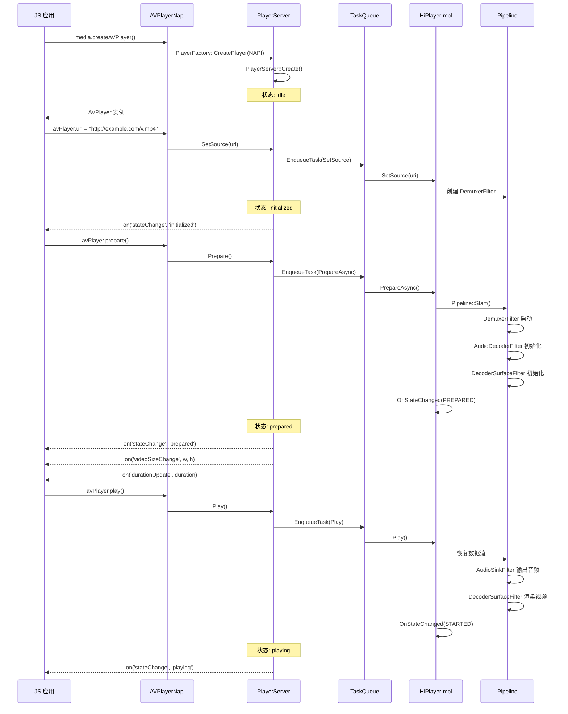
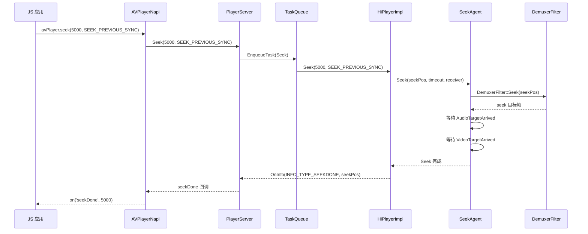
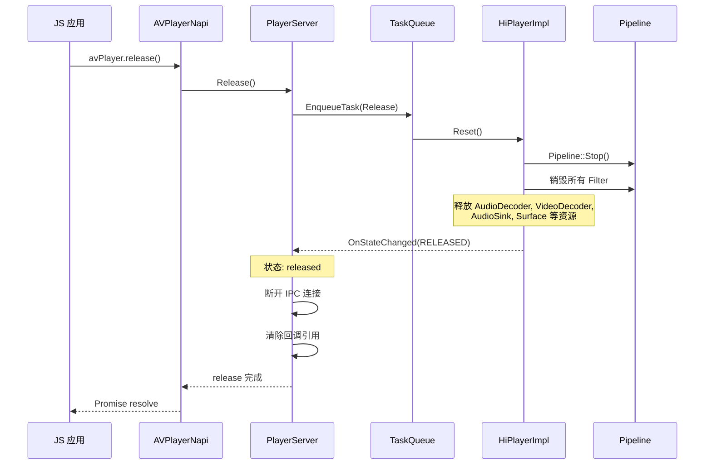

# multimedia_player_framework API 调用链流程

本文档描述从 JS API 到 NAPI 到 Service 到 Engine 的完整调用路径。

## 调用链总览

所有 AVPlayer 操作遵循统一架构模式:

```
JS API 调用
  → NAPI 方法 (AVPlayerNapi::Js*)
  → TaskQueue.EnqueueTask() 异步投递
  → PlayerServer::*() 状态机方法
  → IPlayerEngine 接口调用
  → HiPlayerImpl::*() 引擎实现
  → Pipeline/Filter 链处理
```

源文件参考:
- NAPI 层: `frameworks/js/avplayer/avplayer_napi.cpp`
- Service 层: `services/services/player/server/player_server.cpp`
- Engine 层: `services/engine/histreamer/player/hiplayer_impl.cpp`

---

## 1. media.createAVPlayer() — 创建播放器

### 调用链

```
JS: media.createAVPlayer()
  → NAPI: MediaCreateAVPlayer()
    → AVPlayerNapi::JsCreateAVPlayer(env, info)
      → PlayerFactory::CreatePlayer(PlayerProducer::NAPI)
        → PlayerServer::Create() [静态方法]
          → new PlayerServer()
          → PlayerServer::Init()
            → MediaServer::CreatePlayerServiceStub() [获取 IPC 远端]
            → PlayerClient::Create() [创建 IPC 客户端]
      → new AVPlayerNapi()
      → AVPlayerNapi::Init(env, exports) [注册 JS 属性和事件]
  → 返回 AVPlayer JS 对象
```

### 参数与返回值

- **参数**: 无（Promise 版本）或 `AsyncCallback<AVPlayer>` （回调版本）
- **返回值**: `Promise<AVPlayer>` 或通过 callback 返回 AVPlayer 实例
- **错误码**: `5400101` (No Memory) — 创建失败，内存不足

### 关键实现细节

- `PlayerServer::Create()` 中创建 PlayerServer 实例，调用 `Init()` 完成状态机初始化
- 状态机初始状态为 `idle`（对应 `PLAYER_IDLE`）
- 建议单应用最多创建 16 个 AVPlayer 实例
- 源文件: `frameworks/js/avplayer/avplayer_napi.cpp` (JsCreateAVPlayer 方法)

---

## 2. AVPlayer.prepare — 准备播放

### 调用链

```
JS: avPlayer.prepare()
  → NAPI: AVPlayerNapi::JsPrepare(env, info)
    → context_ -> player_ -> Prepare()
    → PlayerServer::Prepare()
      → PlayerServerStateMachine::ChangeState(PREPARING)
      → TaskQueue.EnqueueTask([this]() {
          → PlayerServer::PrepareAsync()
            → playerEngine_ -> PrepareAsync()
            → HiPlayerImpl::PrepareAsync()
              → Pipeline::Start()
              → DemuxerFilter: 开始解封装
              → 音视频 Decoder 初始化
              → 等待足够缓冲数据
              → OnStateChanged(PLAYER_PREPARED)
          })
```

### 状态机要求

- **前置状态**: `initialized`（已通过 `url`/`fdSrc`/`dataSrc` 设置数据源）
- **目标状态**: `prepared`
- **非法调用**: 在 `idle`/`prepared`/`playing`/`released` 等状态调用返回错误

### 参数与返回值

- **参数**: 无
- **返回值**: `Promise<void>`
- **错误码**:
  - `5400102` — 在错误状态下调用
  - `5400103` — IO 错误（文件/网络不可达）
  - `5400106` — 不支持的格式

### 事件触发

- `stateChange('prepared')` — 准备完成
- `videoSizeChange(width, height)` — 视频尺寸信息（如有视频轨）
- `durationUpdate(duration)` — 时长信息

---

## 3. AVPlayer.play — 开始播放

### 调用链

```
JS: avPlayer.play()
  → NAPI: AVPlayerNapi::JsPlay(env, info)
    → context_ -> player_ -> Play()
    → PlayerServer::Play()
      → TaskQueue.EnqueueTask([this]() {
          → playerEngine_ -> Play()
          → HiPlayerImpl::Play()
            → Pipeline 恢复数据流
            → AudioSinkFilter: 开始音频输出
            → DecoderSurfaceFilter: 开始视频渲染
            → MediaSyncManager: 启动音视频同步时钟
            → OnStateChanged(PLAYER_STARTED)
          })
```

### 状态机要求

- **前置状态**: `prepared`、`paused`、`completed`
- **目标状态**: `playing`
- **特殊处理**: 从 `completed` 状态调用 Play 会从头开始播放

### 事件触发

- `stateChange('playing')` — 播放开始
- `timeUpdate(position)` — 定期位置更新（约每秒）
- `audioInterrupt` — 音频焦点变更（如被电话中断）

---

## 4. AVPlayer.pause — 暂停

### 调用链

```
JS: avPlayer.pause()
  → NAPI: AVPlayerNapi::JsPause(env, info)
    → context_ -> player_ -> Pause()
    → PlayerServer::Pause()
      → TaskQueue.EnqueueTask([this]() {
          → playerEngine_ -> Pause()
          → HiPlayerImpl::Pause(isSystemOperation=false)
            → Pipeline 暂停数据流
            → AudioSinkFilter: 暂停音频输出
            → DecoderSurfaceFilter: 暂停视频渲染
            → MediaSyncManager: 暂停同步时钟
            → OnStateChanged(PLAYER_PAUSED)
          })
```

### 状态机要求

- **前置状态**: `playing`
- **目标状态**: `paused`

---

## 5. AVPlayer.stop — 停止

### 调用链

```
JS: avPlayer.stop()
  → NAPI: AVPlayerNapi::JsStop(env, info)
    → context_ -> player_ -> Stop()
    → PlayerServer::Stop()
      → TaskQueue.EnqueueTask([this]() {
          → playerEngine_ -> Stop()
          → HiPlayerImpl::Stop()
            → Pipeline 停止并 Flush
            → 释放解码器资源（可选保留）
            → OnStateChanged(PLAYER_STOPPED)
          })
```

### 状态机要求

- **前置状态**: `prepared`、`playing`、`paused`、`completed`
- **目标状态**: `stopped`

---

## 6. AVPlayer.release — 释放

### 调用链

```
JS: avPlayer.release()
  → NAPI: AVPlayerNapi::JsRelease(env, info)
    → context_ -> player_ -> Release()
    → PlayerServer::Release()
      → TaskQueue.EnqueueTask([this]() {
          → playerEngine_ -> Reset()
          → HiPlayerImpl::Reset()
            → Pipeline 销毁所有 Filter
            → 释放解码器、Surface 等资源
          → playerEngine_ -> SetObs(nullptr)
          → 断开 IPC 连接
          → OnStateChanged(PLAYER_RELEASED)
          })
```

### 状态机要求

- **前置状态**: 任何非 `released` 状态
- **目标状态**: `released`
- **注意**: release 后不可再使用该实例，需重新 `createAVPlayer()`

---

## 7. AVPlayer.seek — 跳转

### 调用链

```
JS: avPlayer.seek(timeMs, mode)
  → NAPI: AVPlayerNapi::JsSeek(env, info)
    → 解析参数: timeMs (number), mode (SeekMode)
    → context_ -> player_ -> Seek(timeMs, mode)
    → PlayerServer::Seek(timeMs, mode)
      → TaskQueue.EnqueueTask([this]() {
          → playerEngine_ -> Seek(timeMs, mode)
          → HiPlayerImpl::Seek(timeMs, mode)
            → SeekAgent::Seek(seekPos, timeout, receiver)
              → DemuxerFilter::Seek(seekPos)
              → 等待音视频目标帧到达
                AudioBufferFilledListener::OnBufferFilled()
                VideoBufferFilledListener::OnBufferFilled()
              → NotifySeekDone(seekPos)
          })
```

### SeekMode 参数

| 模式 | 说明 |
|------|------|
| `SEEK_PREVIOUS_SYNC` | 跳转到给定时间点之前的最近关键帧 |
| `SEEK_NEXT_SYNC` | 跳转到给定时间点之后的最近关键帧 |
| `SEEK_CLOSEST` | 跳转到最接近给定时间点的帧（可能非关键帧） |

### 状态机要求

- **前置状态**: `prepared`、`playing`、`paused`、`completed`

### 事件触发

- `seekDone(position)` — 跳转完成
- `timeUpdate(position)` — 位置更新

### 连续 Seek（拖拽）

当用户拖拽进度条时，使用 `SeekContinuous` 机制:

```
HiPlayerImpl::SeekContinous(mSeconds, batchNo)
  → DraggingPlayerAgent::UpdateSeekPos(seekMs)
    → SeekContinuousDelegator::UpdateSeekPos() [连续 Seek 模式]
    → SeekClosestDelegator::UpdateSeekPos()     [最近帧模式]
```

源文件:
- `services/engine/histreamer/player/seek_agent.h`
- `services/engine/histreamer/player/dragging_player_agent.h`

---

## 8. AVPlayer.setVolume — 设置音量

### 调用链

```
JS: avPlayer.setVolume(volume)
  → NAPI: AVPlayerNapi::JsSetVolume(env, info)
    → 解析参数: volume (float, 0.0~1.0)
    → context_ -> player_ -> SetVolume(volume, volume)
    → PlayerServer::SetVolume(leftVolume, rightVolume)
      → TaskQueue.EnqueueTask([this]() {
          → playerEngine_ -> SetVolume(leftVolume, rightVolume)
          → HiPlayerImpl::SetVolume(leftVolume, rightVolume)
            → AudioSinkFilter::SetVolume(leftVolume, rightVolume)
            → NotifyVolumeChange()
          })
```

### 参数

- **volume**: `number`，范围 0.0~1.0，步长 0.01
- 左右声道使用相同值

### 事件触发

- `volumeChange(volume)` — 音量变更通知

---

## 9. AVPlayer.setSpeed — 设置播放速度

### 调用链

```
JS: avPlayer.setSpeed(speed)
  → NAPI: AVPlayerNapi::JsSetSpeed(env, info)
    → 解析参数: speed (PlaybackSpeed 枚举)
    → context_ -> player_ -> SetPlaybackSpeed(mode)
    → PlayerServer::SetPlaybackSpeed(mode)
      → TaskQueue.EnqueueTask([this]() {
          → playerEngine_ -> SetPlaybackSpeed(mode)
          → HiPlayerImpl::SetPlaybackSpeed(mode)
            → 计算实际速率 (如 SPEED_FORWARD_2_00_X = 2.0)
            → MediaSyncManager::SetPlaybackRate(rate)
            → AudioSinkFilter: 调整音频输出速率
            → NotifySpeedDone()
          })
```

### PlaybackSpeed 枚举值

| 枚举 | 值 | 速率 |
|------|----|------|
| SPEED_FORWARD_0_125_X | 9 | 0.125x |
| SPEED_FORWARD_0_25_X | 8 | 0.25x |
| SPEED_FORWARD_0_5_X | 5 | 0.5x |
| SPEED_FORWARD_0_75_X | 0 | 0.75x |
| SPEED_FORWARD_1_00_X | 1 | 1.0x (正常) |
| SPEED_FORWARD_1_25_X | 2 | 1.25x |
| SPEED_FORWARD_1_5_X | 6 | 1.5x |
| SPEED_FORWARD_1_75_X | 3 | 1.75x |
| SPEED_FORWARD_2_00_X | 4 | 2.0x |
| SPEED_FORWARD_3_00_X | 7 | 3.0x |
| SPEED_FORWARD_4_00_X | 10 | 4.0x |

源文件: `interfaces/inner_api/native/player.h` (PlaybackRateMode 枚举)

### 事件触发

- `speedDone(speed)` — 速度设置完成

---

## 10. AVPlayer.setUrl — 设置媒体源

### 调用链

```
JS: avPlayer.url = "http://example.com/video.mp4"
  → NAPI: AVPlayerNapi::JsSetUrl(env, info)
    → 解析参数: url (string)
    → 验证状态为 idle
    → context_ -> player_ -> SetSource(url)
    → PlayerServer::SetSource(url)
      → TaskQueue.EnqueueTask([this]() {
          → UriHelper::Parse(url) [判断 URL 类型]
          → playerEngine_ -> SetSource(url)
          → HiPlayerImpl::SetSource(uri)
            → DoSetSource(MediaSource::Create(uri))
            → Pipeline: 创建 DemuxerFilter
            → DemuxerFilter::SetSource(source)
            → OnStateChanged(PLAYER_INITIALIZED)
          })
```

### 状态机要求

- **前置状态**: `idle`
- **目标状态**: `initialized`

### 支持的 URL 格式

- 本地文件: `file:///data/...` 或 `/data/...`
- 网络流: `http://...`, `https://...`
- HLS: `http://....m3u8`
- FD 源: 通过 `fdSrc` 属性设置
- 自定义数据源: 通过 `dataSrc` 属性设置

---

## 核心序列图

### 创建 + 准备 + 播放 序列图



### Seek 序列图



### Release 序列图



---

## 其他 API 调用链

### AVPlayer.reset

```
JS: avPlayer.reset()
  → AVPlayerNapi::JsReset()
    → PlayerServer::Reset()
      → HiPlayerImpl::Reset()
        → Pipeline 销毁 Filter 链
        → 恢复到 idle 状态
```

### AVPlayer.surfaceId (setter)

```
JS: avPlayer.surfaceId = "surface-id-string"
  → AVPlayerNapi::JsSetSurfaceID()
    → PlayerServer::SetVideoSurface(surface)
      → HiPlayerImpl::SetVideoSurface(surface)
        → DecoderSurfaceFilter::SetSurface(surface)
```

### AVPlayer.fdSrc (setter)

```
JS: avPlayer.fdSrc = { fd: fdNumber, offset: 0, length: fileSize }
  → AVPlayerNapi::JsSetAVFileDescriptor()
    → PlayerServer::SetSource(fd, offset, size)
      → HiPlayerImpl::SetSource(fd, offset, size)
```

### AVPlayer.selectBitrate

```
JS: avPlayer.selectBitrate(bitrate)
  → AVPlayerNapi::JsSelectBitrate()
    → PlayerServer::SelectBitRate(bitRate)
      → HiPlayerImpl::SelectBitRate(bitRate, isAutoSelect=false)
        → DemuxerFilter: 切换码率（HLS 场景）
```

### AVPlayer.addSubtitleUrl

```
JS: avPlayer.addSubtitleUrl(url)
  → AVPlayerNapi::JsAddSubtitleUrl()
    → PlayerServer::AddSubtitles(url)
      → HiPlayerImpl::AddSubSource(url)
        → 创建 SubtitleSinkFilter
```

---

## TaskQueue 异步执行机制

所有 PlayerServer 的操作通过 TaskQueue 异步执行，确保线程安全。

源文件: `services/utils/include/task_queue.h`

```
PlayerServer::Play()
  → taskMgr_.EnqueueTask(task)
    → TaskQueue 内部线程执行
      → task->Execute()
        → playerEngine_->Play()
        → 状态机变更
        → 回调通知
```

关键特性:
- 串行执行: 同一 PlayerServer 实例的所有操作严格按入队顺序执行
- 支持取消: `EnqueueTask()` 的 `cancelNotExecuted` 参数可取消未执行的任务
- 支持超时: `TaskHandler::GetResultWithTimeLimit()` 支持带超时的等待
- QoS 设置: `TaskQueue::SetQos()` 可调整线程优先级
