# VPE (Video Processing Engine) 架构总览

## 模块职责与边界

VPE (Video Processing Engine) 是 OpenHarmony 多媒体子系统中的视频/图像处理引擎，负责提供媒体数据的质量增强和格式转换能力。模块边界覆盖从 JS/TS API 到底层算法插件的全栈实现。

**核心能力**:

| 能力域 | 功能说明 | 适用范围 |
|--------|----------|----------|
| 细节增强 (Detail Enhancement) | 图像/视频缩放、超分、锐化 | 图像 + 视频 |
| 色彩空间转换 (Color Space Conversion) | SDR2SDR, HDR2SDR, HDR2HDR, 单双层 HDR 转换 | 图像 + 视频 |
| 动态元数据生成 (Metadata Generation) | HDR Vivid 元数据生成 | 图像 + 视频 |
| 对比度增强 (Contrast Enhancement) | 基于直方图的区域对比度优化 | 图像 |
| AI HDR 增强 (AI HDR Enhancement) | AI 驱动的 HDR 增强处理 | 图像 + 视频 |
| 视频可变帧率预测 (Video VRR) | 视频可变刷新率预测 | 视频 |

**系统归属**: SystemCapability.Multimedia.VideoProcessingEngine

**产物形态**:
- 图像处理: `libimage_processing.so` (ImageKit, since 13)
- 视频处理: `libvideo_processing.so` (MediaKit, since 12)
- JS API: `@ohos.multimedia.videoProcessingEngine` (since 18 dynamic / since 23 static)
- 算法扩展: `libvideoprocessingengine_ext.z.so` (厂商提供)

源文件参考:
- `interfaces/kits/c/image_processing.h` -- 图像 C API 声明
- `interfaces/kits/c/video_processing.h` -- 视频 C API 声明
- `interface_sdk-js/api/@ohos.multimedia.videoProcessingEngine.d.ts` -- JS API 类型声明

---

## 组件层次与模块划分

### 1. Interface Layer (接口层)

接口层提供三种接入方式: JS/TS API、C API 和 ArkTS (Taihe) 绑定。

#### JS/TS API + NAPI 桥接

```
JS: videoProcessingEngine.create() / ImageProcessor.enhanceDetail()
     |
     v
NAPI: VpeNapi (detail_enhance_napi_formal.h)
     |
     v
内部直接调用算法对象 (DetailEnhancerImage / ContrastEnhancerImage)
```

源文件参考:
- `interfaces/kits/js/detail_enhance_napi_formal.h` -- VpeNapi 类声明
- `framework/capi/image_processing/detail_enhance_napi_formal.cpp` -- NAPI 实现
- `interfaces/kits/js/native_module_ohos_imageprocessing.cpp` -- NAPI 模块注册

**注意**: JS API 的 `initializeEnvironment()` / `deinitializeEnvironment()` 当前实现直接返回 `true`，并未实际调用底层 C API 的对应函数。

#### C API (Image Processing)

```
OH_ImageProcessing_* (C 函数)
     |
     v
image_processing.cpp (CAPI 入口)
     |
     v
image_processing_impl.cpp (OH_ImageProcessing 对象)
     |
     v
image_processing_factory.cpp (工厂分发)
```

源文件参考:
- `framework/capi/image_processing/image_processing.cpp` -- CAPI 入口函数
- `framework/capi/image_processing/image_processing_impl.cpp` -- OH_ImageProcessing 实现
- `framework/capi/image_processing/image_processing_factory.cpp` -- 图像处理工厂

#### C API (Video Processing)

```
OH_VideoProcessing_* (C 函数)
     |
     v
video_processing.cpp (CAPI 入口)
     |
     v
video_processing_impl.cpp (OH_VideoProcessing 对象)
     |
     v
video_processing_factory.cpp (工厂分发)
```

源文件参考:
- `framework/capi/video_processing/video_processing.cpp` -- CAPI 入口函数
- `framework/capi/video_processing/video_processing_impl.cpp` -- OH_VideoProcessing 实现
- `framework/capi/video_processing/video_processing_factory.cpp` -- 视频处理工厂

#### ArkTS (Taihe) 绑定

源文件参考:
- `interfaces/kits/taihe/include/video_processing_engine_taihe.h` -- Taihe 头文件
- `interfaces/kits/taihe/src/ani_constructor.cpp` -- ANI 构造函数
- `interfaces/kits/taihe/src/video_processing_engine_taihe.cpp` -- Taihe 实现

---

### 2. Native Layer (Native 对象层)

通过 Factory 模式根据 type 参数分发到不同的 Native 实现。每个 Native 实现继承自基类接口。

**图像处理 Native 类**:

| type 常量 | 值 | Native 类 |
|-----------|-----|-----------|
| IMAGE_PROCESSING_TYPE_COLOR_SPACE_CONVERSION | 0x1 | ColorspaceConverterImageNative |
| IMAGE_PROCESSING_TYPE_COMPOSITION | 0x2 | ColorspaceConverterImageNative |
| IMAGE_PROCESSING_TYPE_DECOMPOSITION | 0x4 | ColorspaceConverterImageNative |
| IMAGE_PROCESSING_TYPE_METADATA_GENERATION | 0x8 | MetadataGeneratorImageNative |
| IMAGE_PROCESSING_TYPE_DETAIL_ENHANCER | 0x10 | DetailEnhancerImageNative |

源文件参考:
- `framework/capi/image_processing/image_processing_factory.cpp` -- 工厂创建映射
- `framework/capi/image_processing/detail_enhancer/detail_enhancer_image_native.cpp`
- `framework/capi/image_processing/colorspace_converter/colorspace_converter_image_native.cpp`

**视频处理 Native 类**:

| type 常量 | 值 | Native 类 |
|-----------|-----|-----------|
| VIDEO_PROCESSING_TYPE_COLOR_SPACE_CONVERSION | 0x1 | ColorSpaceConverterVideoNative |
| VIDEO_PROCESSING_TYPE_METADATA_GENERATION | 0x2 | MetadataGeneratorVideoNative |
| VIDEO_PROCESSING_TYPE_DETAIL_ENHANCER | 0x4 | DetailEnhancerVideoNative |

源文件参考:
- `framework/capi/video_processing/video_processing_factory.cpp` -- 工厂创建映射
- `framework/capi/video_processing/detail_enhancer/detail_enhancer_video_native.cpp`
- `framework/capi/video_processing/colorspace_converter/colorSpace_converter_video_native.cpp`
- `framework/capi/video_processing/metadata_generator/metadata_generator_video_native.cpp`

**能力检测**: Factory 的 `IsValid()` 会检查 `/system/lib64/libvideoprocessingengine_ext.z.so` 是否存在。若厂商扩展库不存在，仅 `DETAIL_ENHANCER` 类型可用。

---

### 3. Framework Layer (原子能力封装层)

每个算法功能按目录组织，包含 `*fwk.cpp` (框架封装) 和对应的 base/capability 头文件。

```
framework/algorithm/
  +-- detail_enhancer/           -- 图像细节增强
  |     detail_enhancer_image_fwk.cpp
  |     include/
  |       detail_enhancer_base.h
  |       detail_enhancer_capability.h
  |       detail_enhancer_image_fwk.h
  +-- detail_enhancer_video/     -- 视频细节增强
  |     detail_enhancer_video_fwk.cpp
  |     detail_enhancer_video_impl.cpp
  +-- colorspace_converter/      -- 图像色彩空间转换
  |     colorspace_converter_fwk.cpp
  +-- colorspace_converter_video/ -- 视频色彩空间转换
  |     colorspace_converter_video_impl.cpp
  +-- colorspace_converter_display/ -- 显示色彩空间转换
  |     colorspace_converter_display_fwk.cpp
  +-- metadata_generator/        -- 图像元数据生成
  |     metadata_generator_fwk.cpp
  +-- metadata_generator_video/  -- 视频元数据生成
  |     metadata_generator_video_impl.cpp
  +-- contrast_enhancer/         -- 图像对比度增强
  |     contrast_enhancer_image_fwk.cpp
  +-- aihdr_enhancer/            -- AI HDR 增强 (图像)
  |     aihdr_enhancer_fwk.cpp
  +-- aihdr_enhancer_video/      -- AI HDR 增强 (视频)
  |     aihdr_enhancer_video_impl.cpp
  +-- video_variable_refresh_rate/ -- 视频可变刷新率
  |     video_refreshrate_prediction_fwk.cpp
  +-- common/                    -- 公共工具
  |     algorithm_common.cpp, algorithm_utils.cpp, vpe_context.cpp
  |     include/ (vpe_context.h, image_opencl_wrapper.h, frame_info.h, ...)
  +-- extension_manager/         -- 扩展插件管理
  +-- extensions/                -- 具体插件实现 (如 Skia)
```

**基类模式**: 每个算法继承自对应的 Base 类，提供统一接口:
- `DetailEnhancerBase` -> `detail_enhancer/include/detail_enhancer_base.h`
- `ColorSpaceConverterBase` -> `colorspace_converter/include/colorspace_converter_base.h`
- `MetadataGeneratorBase` -> `metadata_generator/include/metadata_generator_base.h`
- `ContrastEnhancerBase` -> `contrast_enhancer/include/contrast_enhancer_base.h`

---

### 4. Extension Plugin Layer (算法插件层)

扩展插件系统通过 `ExtensionManager` 单例管理算法插件的注册、查询和调用。

**架构**:
```
ExtensionManager (单例)
  |
  +-- 静态注册: static_extension_list.h
  |     目前注册了 Skia 插件 (SKIA_ENABLE 宏控制)
  |
  +-- 动态加载: dlopen("libvideoprocessingengine_ext.z.so")
        厂商提供的算法扩展库
```

源文件参考:
- `framework/algorithm/extension_manager/extension_manager.cpp` -- 插件管理器实现
- `framework/algorithm/extension_manager/include/extension_manager.h` -- 管理器接口
- `framework/algorithm/extension_manager/include/static_extension_list.h` -- 静态插件列表
- `framework/algorithm/extension_manager/include/extension_base.h` -- 插件基类
- `framework/algorithm/extensions/skia/skia_impl.cpp` -- Skia 插件实现

**扩展接口头文件** (每个算法对应一个):
- `extension_manager/include/detail_enhancer_extension.h`
- `extension_manager/include/colorspace_converter_extension.h`
- `extension_manager/include/colorspace_converter_display_extension.h`
- `extension_manager/include/metadata_generator_extension.h`
- `extension_manager/include/contrast_enhancer_extension.h`
- `extension_manager/include/aihdr_enhancer_extension.h`
- `extension_manager/include/video_refreshrate_prediction_extension.h`

**实例计数**: ExtensionManager 维护 `usedInstance_` 计数器，管理 `dlopen`/`dlclose` 生命周期。

---

### 5. Service Layer (服务层)

提供 IPC 通信的 Client/Server 模式，用于跨进程调用。

```
services/
  +-- src/
  |     video_processing_client.cpp   -- 客户端代理
  |     video_processing_server.cpp   -- 服务端桩
  |     video_processing_load_callback.cpp -- SA 加载回调
  +-- include/
  |     video_processing_client.h
  |     video_processing_server.h
  |     video_processing_load_callback.h
  +-- algorithm/
  |     video_processing_algorithm_factory.cpp -- 算法工厂
  |     video_processing_algorithm_base.cpp    -- 算法基类
  |     include/ (ivideo_processing_algorithm.h, ...)
  +-- utils/
        vpe_sa_utils.cpp, surface_buffer_info.cpp
        include/ (vpe_sa_constants.h, surface_buffer_info.h, ...)
```

**SA 标识**: `VIDEO_PROCESSING_SERVER_SA_ID = 0x00010256` (即 66134)
源文件参考: `services/utils/include/vpe_sa_constants.h`

---

### 6. Inner API (内部接口层)

内部接口定义了算法的抽象接口，供 Framework 和 Service 层调用。

```
interfaces/inner_api/
  algorithm_common.h           -- 图像算法公共接口
  algorithm_video.h            -- 视频算法接口
  algorithm_video_common.h     -- 视频算法公共接口
  algorithm_errors.h           -- 内部错误码定义
  detail_enhancer_common.h / detail_enhancer_image.h / detail_enhancer_video.h
  colorspace_converter.h / colorspace_converter_video.h / ...
  metadata_generator.h / metadata_generator_video.h
  contrast_enhancer_common.h / contrast_enhancer_image.h
  aihdr_enhancer.h / aihdr_enhancer_video.h
  video_refreshrate_prediction.h
```

---

### 7. DFX (诊断与可观测性)

```
framework/dfx/
  include/vpe_log.h      -- 日志宏定义 (LOG_DOMAIN: 0xD002B3F)
  include/vpe_trace.h    -- 性能追踪
  vpe_log.cpp
  vpe_trace.cpp
```

---

## 依赖关系

### 外部依赖

| 依赖模块 | 用途 | 接口形式 |
|----------|------|----------|
| graphic_graphic_2d | SurfaceBuffer 操作 | OHNativeWindow |
| graphic_graphic_surface | 视频 Surface 管理 | OHNativeWindow |
| multimedia_image_framework | PixelMap 图像数据 | OH_PixelmapNative |
| multimedia_media_foundation | 格式参数传递 | OH_AVFormat |
| third_party_skia | 图像缩放算法 | Skia API |
| lib GLES / OpenCL | GPU 计算 | OpenGL ES / OpenCL |

### 内部依赖关系

```
Interface Layer (JS/NAPI/CAPI)
    |
    v
Native Layer (Factory -> *Native)
    |
    v
Framework Layer (*Fwk -> *Base)
    |
    v
Extension Plugin Layer (ExtensionManager -> Extension)
    |
    v
External Algorithm Plugins (Skia / Vendor Extension)
```

---

## 架构组件关系图

```mermaid
flowchart TB
    subgraph Interface ["Interface Layer (接口层)"]
        JS_API["JS API<br/>videoProcessingEngine.*"]
        NAPI["NAPI Bridge<br/>VpeNapi"]
        C_IMG["C API (Image)<br/>OH_ImageProcessing_*"]
        C_VID["C API (Video)<br/>OH_VideoProcessing_*"]
        TAIHE["ArkTS (Taihe)<br/>video_processing_engine_taihe"]
    end

    subgraph CAPI ["CAPI Layer (C API 实现层)"]
        IMG_ENTRY["image_processing.cpp"]
        IMG_IMPL["image_processing_impl.cpp<br/>OH_ImageProcessing"]
        IMG_FAC["image_processing_factory.cpp"]
        VID_ENTRY["video_processing.cpp"]
        VID_IMPL["video_processing_impl.cpp<br/>OH_VideoProcessing"]
        VID_FAC["video_processing_factory.cpp"]
    end

    subgraph Native ["Native Layer"]
        DI_IMG["DetailEnhancerImageNative"]
        CC_IMG["ColorspaceConverterImageNative"]
        MG_IMG["MetadataGeneratorImageNative"]
        DI_VID["DetailEnhancerVideoNative"]
        CC_VID["ColorSpaceConverterVideoNative"]
        MG_VID["MetadataGeneratorVideoNative"]
        ENV_IMG["ImageEnvironmentNative"]
        ENV_VID["VideoEnvironmentNative"]
    end

    subgraph Fwk ["Framework Layer (算法框架层)"]
        DI_FWK["DetailEnhancerImageFwk"]
        DI_VFWK["DetailEnhancerVideoFwk/Impl"]
        CC_FWK["ColorspaceConverterFwk"]
        CC_VFWK["ColorspaceConverterVideoImpl"]
        MG_FWK["MetadataGeneratorFwk"]
        MG_VFWK["MetadataGeneratorVideoImpl"]
        CE_FWK["ContrastEnhancerImageFwk"]
        AI_FWK["AihdrEnhancerFwk"]
        AI_VFWK["AihdrEnhancerVideoImpl"]
        VRR_FWK["VideoRefreshratePredictionFwk"]
        CCD_FWK["ColorspaceConverterDisplayFwk"]
        COMMON["Common Utils<br/>vpe_context, opencl_wrapper"]
    end

    subgraph ExtMgr ["Extension Plugin Layer"]
        EM["ExtensionManager<br/>(Singleton)"]
        STATIC["Static Extensions<br/>static_extension_list.h"]
        SKIA["Skia Plugin"]
        VENDOR["Vendor Extension<br/>libvideoprocessingengine_ext.z.so"]
    end

    subgraph Svc ["Service Layer (IPC)"]
        SVC_CLIENT["VideoProcessingClient"]
        SVC_SERVER["VideoProcessingServer<br/>SA ID: 66134"]
    end

    subgraph DFX ["DFX"]
        LOG["vpe_log"]
        TRACE["vpe_trace"]
    end

    JS_API --> NAPI
    NAPI --> DI_IMG
    NAPI --> CE_FWK

    C_IMG --> IMG_ENTRY
    IMG_ENTRY --> IMG_IMPL
    IMG_IMPL --> IMG_FAC
    IMG_FAC --> DI_IMG & CC_IMG & MG_IMG

    C_VID --> VID_ENTRY
    VID_ENTRY --> VID_IMPL
    VID_IMPL --> VID_FAC
    VID_FAC --> DI_VID & CC_VID & MG_VID

    TAIHE -.-> IMG_IMPL

    DI_IMG --> DI_FWK
    CC_IMG --> CC_FWK
    MG_IMG --> MG_FWK
    DI_VID --> DI_VFWK
    CC_VID --> CC_VFWK
    MG_VID --> MG_VFWK

    ENV_IMG -.-> IMG_ENTRY
    ENV_VID -.-> VID_ENTRY

    DI_FWK & CC_FWK & MG_FWK & DI_VFWK & CC_VFWK & MG_VFWK --> EM
    CE_FWK & AI_FWK & AI_VFWK & VRR_FWK & CCD_FWK --> EM
    COMMON -.-> DI_FWK & CC_FWK

    EM --> STATIC
    STATIC --> SKIA
    EM --> VENDOR

    SVC_CLIENT -.-> SVC_SERVER
    SVC_SERVER -.-> EM

    DI_FWK & CC_FWK & MG_FWK -.-> LOG & TRACE
```



---

## 源码目录结构

```
multimedia_video_processing_engine/
  BUILD.gn                         -- 构建配置
  bundle.json                      -- 部件描述
  config.gni                       -- 构建参数
  interfaces/
    kits/                          -- 公共 API
      c/                           -- C API 头文件
        image_processing.h
        image_processing_types.h
        video_processing.h
        video_processing_types.h
      js/                          -- JS/NAPI 桥接
        detail_enhance_napi_formal.h
        native_module_ohos_imageprocessing.cpp
      taihe/                       -- ArkTS 绑定
    inner_api/                     -- 内部接口
      algorithm_common.h
      algorithm_errors.h
      detail_enhancer_*.h
      colorspace_converter*.h
      metadata_generator*.h
      contrast_enhancer_*.h
      aihdr_enhancer*.h
      video_refreshrate_prediction.h
  framework/
    capi/                          -- C API 实现
      image_processing/            -- 图像处理 CAPI
      video_processing/            -- 视频处理 CAPI
    algorithm/                     -- 算法框架
      detail_enhancer/
      detail_enhancer_video/
      colorspace_converter/
      colorspace_converter_video/
      colorspace_converter_display/
      metadata_generator/
      metadata_generator_video/
      contrast_enhancer/
      aihdr_enhancer/
      aihdr_enhancer_video/
      video_variable_refresh_rate/
      common/
      extension_manager/
      extensions/skia/
    dfx/                           -- 日志与追踪
  services/                        -- IPC 服务层
    src/
    include/
    algorithm/
    utils/
  test/                            -- 测试用例
```
