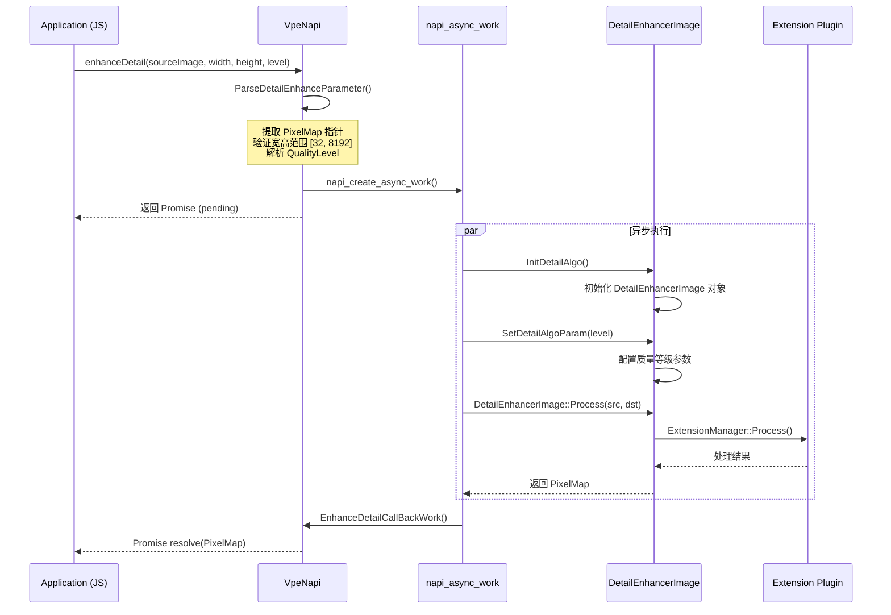

# VPE API 调用链流程

本文档描述从各 API 入口到最终算法执行的完整调用路径。

---

## 1. JS API 调用链

### 1.1 videoProcessingEngine.create() — 创建 ImageProcessor 实例

**调用链**:
```
JS: videoProcessingEngine.create()
  -> VpeNapi::Create()                          [detail_enhance_napi_formal.cpp]
    -> napi_new_instance()
      -> VpeNapi::Constructor()                 [detail_enhance_napi_formal.cpp]
        -> 构造 VpeNapi 对象，绑定 JS 实例
```

**参数传递**: 无参数
**返回值**: `ImageProcessor` 实例 (JS 对象)
**错误码**: 801 (能力不支持), 29200003 (创建失败), 29200007 (内存不足)

源文件:
- `interfaces/kits/js/detail_enhance_napi_formal.h`
- `framework/capi/image_processing/detail_enhance_napi_formal.cpp`

---

### 1.2 videoProcessingEngine.initializeEnvironment() — 初始化环境

**调用链**:
```
JS: videoProcessingEngine.initializeEnvironment()
  -> VpeNapi::InitializeEnvironment()           [detail_enhance_napi_formal.cpp]
    -> 直接返回 true (Promise resolve)
```

**注意**: 当前 NAPI 实现直接返回 `true`，**未实际调用**底层 C API 的 `OH_ImageProcessing_InitializeEnvironment`。这意味着 JS 层的环境初始化目前是空操作。

**返回值**: `Promise<void>`
**错误码**: 801 (能力不支持), 29200006 (操作不被允许)

源文件: `framework/capi/image_processing/detail_enhance_napi_formal.cpp`

---

### 1.3 videoProcessingEngine.deinitializeEnvironment() — 反初始化环境

**调用链**:
```
JS: videoProcessingEngine.deinitializeEnvironment()
  -> VpeNapi::DeinitializeEnvironment()         [detail_enhance_napi_formal.cpp]
    -> 直接返回 true (Promise resolve)
```

**注意**: 与 `initializeEnvironment()` 相同，直接返回 `true`，未调用底层 C API。

**返回值**: `Promise<void>`
**错误码**: 29200006 (操作不被允许)

源文件: `framework/capi/image_processing/detail_enhance_napi_formal.cpp`

---

### 1.4 ImageProcessor.enhanceDetail(sourceImage, width, height, level?) — 异步细节增强 (按尺寸)

**调用链**:
```
JS: processor.enhanceDetail(sourceImage, width, height, level?)
  -> VpeNapi::EnhanceDetail()                   [detail_enhance_napi_formal.cpp]
    -> ParseDetailEnhanceParameter()            解析 PixelMap + 宽高 + 级别参数
    -> napi_create_async_work()                 创建异步工作
    -> [async] EnhanceDetailWork()
      -> DetailEnhanceImpl()
        -> InitDetailAlgo()                     初始化 DetailEnhancerImage 算法对象
        -> SetDetailAlgoParam()                 设置质量等级参数
        -> DetailEnhancerImage::Process()       执行细节增强算法
    -> [callback] EnhanceDetailCallBackWork()
      -> 返回结果 PixelMap
```

**参数传递**:
- `sourceImage`: `image.PixelMap` -- 源图像，通过 NAPI 提取底层 PixelMap 指针
- `width`: `int` -- 目标宽度 (范围: 32-8192)
- `height`: `int` -- 目标高度 (范围: 32-8192)
- `level`: `QualityLevel` (可选, 默认 LOW=1) -- 质量等级

**返回值**: `Promise<image.PixelMap>` -- 处理后的目标图像
**错误码**: 801, 29200007, 29200009

源文件: `framework/capi/image_processing/detail_enhance_napi_formal.cpp`

---

### 1.5 ImageProcessor.enhanceDetail(sourceImage, scale, level?) — 异步细节增强 (按比例)

**调用链**:
```
JS: processor.enhanceDetail(sourceImage, scale, level?)
  -> VpeNapi::EnhanceDetail()                   [detail_enhance_napi_formal.cpp]
    -> ParseDetailEnhanceParameter()            解析 PixelMap + 缩放比例参数
    -> ConfigResolutionBasedOnRatio()           根据比例计算目标宽高
    -> napi_create_async_work()                 创建异步工作
    -> [async] EnhanceDetailWork()
      -> DetailEnhanceImpl()
        -> InitDetailAlgo()
        -> SetDetailAlgoParam()
        -> DetailEnhancerImage::Process()
    -> [callback] EnhanceDetailCallBackWork()
```

**参数传递**:
- `sourceImage`: `image.PixelMap`
- `scale`: `double` -- 缩放比例
- `level`: `QualityLevel` (可选)

**返回值**: `Promise<image.PixelMap>`
**错误码**: 801, 29200007, 29200009

源文件: `framework/capi/image_processing/detail_enhance_napi_formal.cpp`

---

### 1.6 ImageProcessor.enhanceDetailSync(sourceImage, width/height/scale, level?) — 同步细节增强

**调用链**:
```
JS: processor.enhanceDetailSync(sourceImage, width, height, level?)
  -> VpeNapi::EnhanceDetailSync()               [detail_enhance_napi_formal.cpp]
    -> ParseDetailEnhanceParameter()            同步解析参数
    -> DetailEnhanceImpl()                      直接同步调用
      -> InitDetailAlgo()
      -> SetDetailAlgoParam()
      -> DetailEnhancerImage::Process()
    -> 直接返回结果 PixelMap
```

**返回值**: `image.PixelMap` 或 `undefined` (失败时)
**错误码**: 801, 29200004 (处理超时), 29200007, 29200009

源文件: `framework/capi/image_processing/detail_enhance_napi_formal.cpp`

---

## 2. C Image Processing API 调用链

### 2.1 OH_ImageProcessing_InitializeEnvironment — 初始化环境

**调用链**:
```
OH_ImageProcessing_InitializeEnvironment()      [image_processing.cpp]
  -> ImageProcessingCapiCapability::Get().OpenCLInit()    检查 OpenCL 初始化
  -> ImageProcessingCapiCapability::Get().OpenGLInit()    检查 OpenGL 初始化
  -> ImageEnvironmentNative::Get().Initialize()           初始化全局图像环境
```

**参数**: 无
**返回值**: `ImageProcessing_ErrorCode`
- `IMAGE_PROCESSING_SUCCESS` (0) -- 成功
- `IMAGE_PROCESSING_ERROR_INITIALIZE_FAILED` (29200002) -- GPU 环境初始化失败
- `IMAGE_PROCESSING_ERROR_UNSUPPORTED_PROCESSING` (29200005) -- OpenCL/OpenGL 不可用

源文件: `framework/capi/image_processing/image_processing.cpp`

---

### 2.2 OH_ImageProcessing_Create — 创建图像处理实例

**调用链**:
```
OH_ImageProcessing_Create(&processor, type)     [image_processing.cpp]
  -> OH_ImageProcessing::Create()               [image_processing_impl.cpp]
    -> ImageProcessingFactory::IsValid(type)     验证 type 是否有效
    -> new OH_ImageProcessing(type)              创建包装对象
      -> ImageProcessingFactory::CreateImageProcessing(type)  [image_processing_factory.cpp]
        -> 根据 type 分发:
           DETAIL_ENHANCER (0x10)      -> DetailEnhancerImageNative
           COLOR_SPACE_CONVERSION (0x1) -> ColorspaceConverterImageNative
           COMPOSITION (0x2)            -> ColorspaceConverterImageNative
           DECOMPOSITION (0x4)          -> ColorspaceConverterImageNative
           METADATA_GENERATION (0x8)    -> MetadataGeneratorImageNative
    -> obj->Initialize()                        初始化 Native 对象
```

**参数传递**:
- `imageProcessor`: `OH_ImageProcessing**` -- 输出参数，必须为 nullptr
- `type`: `int32_t` -- 处理类型 (IMAGE_PROCESSING_TYPE_* 常量)

**返回值**: `ImageProcessing_ErrorCode`
- `IMAGE_PROCESSING_SUCCESS` -- 成功
- `IMAGE_PROCESSING_ERROR_INVALID_PARAMETER` (401) -- type 无效
- `IMAGE_PROCESSING_ERROR_UNSUPPORTED_PROCESSING` (29200005) -- 设备不支持该类型
- `IMAGE_PROCESSING_ERROR_CREATE_FAILED` (29200003) -- 创建失败
- `IMAGE_PROCESSING_ERROR_INVALID_INSTANCE` (29200008) -- 指针无效
- `IMAGE_PROCESSING_ERROR_NO_MEMORY` (29200007) -- 内存不足

源文件:
- `framework/capi/image_processing/image_processing.cpp`
- `framework/capi/image_processing/image_processing_impl.cpp`
- `framework/capi/image_processing/image_processing_factory.cpp`

---

### 2.3 OH_ImageProcessing_Destroy — 销毁实例

**调用链**:
```
OH_ImageProcessing_Destroy(processor)            [image_processing.cpp]
  -> OH_ImageProcessing::Destroy()               [image_processing_impl.cpp]
    -> obj->Deinitialize()                       清理 Native 资源
    -> delete instance                           释放包装对象
```

源文件: `framework/capi/image_processing/image_processing_impl.cpp`

---

### 2.4 OH_ImageProcessing_SetParameter / GetParameter — 参数设置与获取

**调用链**:
```
OH_ImageProcessing_SetParameter(processor, parameter)  [image_processing.cpp]
  -> CallImageProcessing()                      获取内部 Native 对象
    -> IImageProcessingNative::SetParameter()    传递 OH_AVFormat 参数

OH_ImageProcessing_GetParameter(processor, parameter)  [image_processing.cpp]
  -> CallImageProcessing()
    -> IImageProcessingNative::GetParameter()
```

**参数**: `OH_AVFormat*` -- 包含键值对参数 (如 QualityLevel)

源文件: `framework/capi/image_processing/image_processing.cpp`

---

### 2.5 OH_ImageProcessing_ConvertColorSpace — 色彩空间转换

**调用链**:
```
OH_ImageProcessing_ConvertColorSpace(processor, src, dst)  [image_processing.cpp]
  -> CallImageProcessing()
    -> IImageProcessingNative::ConvertColorSpace()
      -> ColorspaceConverterImageNative
        -> ColorspaceConverterFwk
          -> ExtensionManager -> Extension Plugin
```

**参数传递**:
- `sourceImage`: `OH_PixelmapNative*` -- 输入图像
- `destinationImage`: `OH_PixelmapNative*` -- 输出图像 (需预分配)

源文件: `framework/capi/image_processing/image_processing.cpp`

---

### 2.6 OH_ImageProcessing_Compose / Decompose — HDR 合成与分解

**调用链**:
```
OH_ImageProcessing_Compose(processor, src, gainmap, dst)   [image_processing.cpp]
  -> CallImageProcessing()
    -> IImageProcessingNative::Compose()
      -> ColorspaceConverterImageNative (type=COMPOSITION)

OH_ImageProcessing_Decompose(processor, src, dst, gainmap) [image_processing.cpp]
  -> CallImageProcessing()
    -> IImageProcessingNative::Decompose()
      -> ColorspaceConverterImageNative (type=DECOMPOSITION)
```

源文件: `framework/capi/image_processing/image_processing.cpp`

---

### 2.7 OH_ImageProcessing_GenerateMetadata — 元数据生成

**调用链**:
```
OH_ImageProcessing_GenerateMetadata(processor, src)  [image_processing.cpp]
  -> CallImageProcessing()
    -> IImageProcessingNative::GenerateMetadata()
      -> MetadataGeneratorImageNative
        -> MetadataGeneratorFwk
          -> ExtensionManager -> Extension Plugin
```

源文件: `framework/capi/image_processing/image_processing.cpp`

---

### 2.8 OH_ImageProcessing_EnhanceDetail — 细节增强

**调用链**:
```
OH_ImageProcessing_EnhanceDetail(processor, src, dst)  [image_processing.cpp]
  -> CallImageProcessing()
    -> IImageProcessingNative::Process()
      -> DetailEnhancerImageNative
        -> DetailEnhancerImageFwk
          -> ExtensionManager -> Extension Plugin (如 Skia)
```

源文件: `framework/capi/image_processing/image_processing.cpp`

---

## 3. C Video Processing API 调用链

### 3.1 OH_VideoProcessing_InitializeEnvironment — 初始化视频环境

**调用链**:
```
OH_VideoProcessing_InitializeEnvironment()       [video_processing.cpp]
  -> VideoProcessingCapiCapability::Init()       检查能力
  -> VideoEnvironmentNative::Initialize()        初始化全局视频环境
```

源文件: `framework/capi/video_processing/video_processing.cpp`

---

### 3.2 OH_VideoProcessing_Create — 创建视频处理实例

**调用链**:
```
OH_VideoProcessing_Create(&processor, type)      [video_processing.cpp]
  -> OH_VideoProcessing::Create()                [video_processing_impl.cpp]
    -> VideoProcessingFactory::IsValid(type)      验证 type (检查 ext 库是否存在)
    -> new OH_VideoProcessing(type)               创建包装对象
      -> VideoProcessingFactory::CreateVideoProcessing(type, context)  [video_processing_factory.cpp]
        -> 根据 type 分发:
           DETAIL_ENHANCER (0x4)           -> DetailEnhancerVideoNative
           COLOR_SPACE_CONVERSION (0x1)    -> ColorSpaceConverterVideoNative
           METADATA_GENERATION (0x2)       -> MetadataGeneratorVideoNative
    -> obj->Initialize()                         初始化 (含 OpenGL 上下文)
```

源文件:
- `framework/capi/video_processing/video_processing.cpp`
- `framework/capi/video_processing/video_processing_impl.cpp`
- `framework/capi/video_processing/video_processing_factory.cpp`

---

### 3.3 OH_VideoProcessing_RegisterCallback — 注册回调

**调用链**:
```
OH_VideoProcessing_RegisterCallback(processor, callback, userData)  [video_processing.cpp]
  -> CallVideoProcessing()
    -> IVideoProcessingNative::RegisterCallback()
      -> VideoProcessingNativeBase
        -> 保存 callback 和 userData
```

**回调类型**:
- `OnError`: 错误回调
- `OnState`: 状态变更回调 (RUNNING / STOPPED)
- `OnNewOutputBuffer`: 新输出缓冲区就绪回调

源文件: `framework/capi/video_processing/video_processing.cpp`

---

### 3.4 OH_VideoProcessing_SetSurface / GetSurface — Surface 管理

**调用链**:
```
OH_VideoProcessing_SetSurface(processor, window)  [video_processing.cpp]
  -> CallVideoProcessing()
    -> IVideoProcessingNative::SetOutputSurface()

OH_VideoProcessing_GetSurface(processor, &window)  [video_processing.cpp]
  -> CallVideoProcessing()
    -> IVideoProcessingNative::CreateInputSurface()
```

源文件: `framework/capi/video_processing/video_processing.cpp`

---

### 3.5 OH_VideoProcessing_Start / Stop — 启停控制

**调用链**:
```
OH_VideoProcessing_Start(processor)              [video_processing.cpp]
  -> CallVideoProcessing()
    -> IVideoProcessingNative::Start()
      -> VideoProcessingNativeBase
        -> 检查前置条件 (Surface 已设置)
        -> 启动处理循环
        -> OnState(RUNNING) callback             回调通知运行状态

OH_VideoProcessing_Stop(processor)               [video_processing.cpp]
  -> CallVideoProcessing()
    -> IVideoProcessingNative::Stop()
      -> VideoProcessingNativeBase
        -> 处理完缓存 buffer
        -> OnState(STOPPED) callback             回调通知停止状态
```

源文件: `framework/capi/video_processing/video_processing.cpp`

---

### 3.6 OH_VideoProcessing_RenderOutputBuffer — 渲染输出

**调用链**:
```
OH_VideoProcessing_RenderOutputBuffer(processor, index)  [video_processing.cpp]
  -> CallVideoProcessing()
    -> IVideoProcessingNative::RenderOutputBuffer()
      -> 将指定 index 的输出 buffer 发送到输出 Surface
```

**调用时机**: 在 `OnNewOutputBuffer` 回调中收到 index 后调用。

源文件: `framework/capi/video_processing/video_processing.cpp`

---

### 3.7 Callback 对象管理

**调用链**:
```
OH_VideoProcessingCallback_Create(&callback)     [video_processing_callback_impl.cpp]
  -> 创建 VideoProcessing_Callback 对象

OH_VideoProcessingCallback_BindOnError(callback, onError)
  -> 绑定 OnError 回调函数指针

OH_VideoProcessingCallback_BindOnState(callback, onState)
  -> 绑定 OnState 回调函数指针

OH_VideoProcessingCallback_BindOnNewOutputBuffer(callback, onNewOutputBuffer)
  -> 绑定 OnNewOutputBuffer 回调函数指针

OH_VideoProcessingCallback_Destroy(callback)
  -> 销毁 VideoProcessing_Callback 对象
```

源文件: `framework/capi/video_processing/video_processing_callback_impl.cpp`

---

## 4. 完整调用链时序图

### 4.1 JS enhanceDetail 异步调用时序



### 4.2 C Image Processing 完整生命周期时序

```mermaid
sequenceDiagram
    participant App as Application (C)
    participant CAPI as image_processing.cpp
    participant Impl as OH_ImageProcessing
    participant Factory as ImageProcessingFactory
    participant Native as *ImageNative
    participant Fwk as *Fwk
    participant Ext as Extension Plugin

    rect rgb(240, 248, 255)
        Note over App,Ext: 环境初始化阶段
        App->>CAPI: OH_ImageProcessing_InitializeEnvironment()
        CAPI->>CAPI: OpenCLInit() + OpenGLInit()
        CAPI->>CAPI: ImageEnvironmentNative::Initialize()
        CAPI-->>App: SUCCESS
    end

    rect rgb(255, 248, 240)
        Note over App,Ext: 实例创建阶段
        App->>CAPI: OH_ImageProcessing_Create(&processor, type)
        CAPI->>Impl: OH_ImageProcessing::Create()
        Impl->>Factory: IsValid(type)
        Factory-->>Impl: true
        Impl->>Factory: CreateImageProcessing(type)
        Factory-->>Impl: *ImageNative 实例
        Impl->>Native: Initialize()
        Native-->>CAPI-->>App: SUCCESS
    end

    rect rgb(240, 255, 240)
        Note over App,Ext: 参数设置阶段
        App->>CAPI: OH_ImageProcessing_SetParameter(processor, format)
        CAPI->>Native: SetParameter(format)
        Native-->>CAPI-->>App: SUCCESS
    end

    rect rgb(255, 255, 240)
        Note over App,Ext: 图像处理阶段
        App->>CAPI: OH_ImageProcessing_EnhanceDetail(processor, src, dst)
        CAPI->>Native: Process(src, dst)
        Native->>Fwk: 调用对应 Fwk 方法
        Fwk->>Ext: ExtensionManager::Process()
        Ext-->>Fwk: 处理结果
        Fwk-->>Native-->>CAPI-->>App: SUCCESS
    end

    rect rgb(248, 240, 255)
        Note over App,Ext: 销毁阶段
        App->>CAPI: OH_ImageProcessing_Destroy(processor)
        CAPI->>Impl: Destroy()
        Impl->>Native: Deinitialize()
        Native-->>Impl: SUCCESS
        Impl->>Impl: delete instance
        Impl-->>CAPI-->>App: SUCCESS
    end

    rect rgb(248, 248, 248)
        Note over App,CAPI: 环境反初始化
        App->>CAPI: OH_ImageProcessing_DeinitializeEnvironment()
        CAPI->>CAPI: ImageEnvironmentNative::Deinitialize()
        CAPI-->>App: SUCCESS
    end
```

### 4.3 C Video Processing 完整生命周期时序

```mermaid
sequenceDiagram
    participant App as Application (C)
    participant CAPI as video_processing.cpp
    participant Impl as OH_VideoProcessing
    participant Native as *VideoNative
    participant Ext as Extension Plugin

    rect rgb(240, 248, 255)
        Note over App,Ext: 环境初始化 + 实例创建
        App->>CAPI: OH_VideoProcessing_InitializeEnvironment()
        CAPI->>CAPI: VideoEnvironmentNative::Initialize()
        CAPI-->>App: SUCCESS

        App->>CAPI: OH_VideoProcessing_Create(&processor, type)
        CAPI->>Impl: Create()
        Impl->>Impl: VideoProcessingFactory::CreateVideoProcessing(type)
        Impl->>Native: Initialize()
        Native-->>CAPI-->>App: SUCCESS
    end

    rect rgb(255, 248, 240)
        Note over App,Ext: 回调与 Surface 配置
        App->>CAPI: OH_VideoProcessingCallback_Create(&callback)
        App->>CAPI: BindOnError / BindOnState / BindOnNewOutputBuffer
        App->>CAPI: OH_VideoProcessing_RegisterCallback(processor, callback, userData)
        CAPI->>Native: RegisterCallback()
        Native-->>App: SUCCESS

        App->>CAPI: OH_VideoProcessing_SetSurface(processor, outputWindow)
        CAPI->>Native: SetOutputSurface()
        Native-->>App: SUCCESS

        App->>CAPI: OH_VideoProcessing_GetSurface(processor, &inputWindow)
        CAPI->>Native: CreateInputSurface()
        Native-->>App: SUCCESS (input surface)
    end

    rect rgb(240, 255, 240)
        Note over App,Ext: 参数设置与启动
        App->>CAPI: OH_VideoProcessing_SetParameter(processor, format)
        App->>CAPI: OH_VideoProcessing_Start(processor)
        CAPI->>Native: Start()
        Native-->>Native: 启动处理循环
        Native-->>App: OnState(RUNNING) callback
    end

    rect rgb(255, 255, 240)
        Note over App,Ext: 数据处理循环
        loop 每帧数据处理
            Native->>Ext: Extension::Process(inputBuffer)
            Ext-->>Native: 输出 buffer 就绪
            Native-->>App: OnNewOutputBuffer(index) callback
            App->>CAPI: OH_VideoProcessing_RenderOutputBuffer(processor, index)
            CAPI->>Native: RenderOutputBuffer(index)
        end
    end

    rect rgb(248, 240, 255)
        Note over App,Ext: 停止与销毁
        App->>CAPI: OH_VideoProcessing_Stop(processor)
        CAPI->>Native: Stop()
        Native-->>App: OnState(STOPPED) callback

        App->>CAPI: OH_VideoProcessing_Destroy(processor)
        CAPI->>Native: Deinitialize()
        CAPI->>CAPI: delete instance
        CAPI-->>App: SUCCESS

        App->>CAPI: OH_VideoProcessing_DeinitializeEnvironment()
        CAPI-->>App: SUCCESS
    end
```

---

## 5. CallImageProcessing / CallVideoProcessing 模式

两个 CAPI 入口文件都使用相同的辅助函数模式来安全地调用 Native 对象:

```cpp
// image_processing.cpp
ImageProcessing_ErrorCode CallImageProcessing(OH_ImageProcessing* imageProcessor,
    std::function<ImageProcessing_ErrorCode(std::shared_ptr<IImageProcessingNative>&)>&& operation)
{
    CHECK_AND_RETURN_RET_LOG(imageProcessor != nullptr, IMAGE_PROCESSING_ERROR_INVALID_INSTANCE, ...);
    auto imageProcessing = imageProcessor->GetImageProcessing();
    CHECK_AND_RETURN_RET_LOG(imageProcessing != nullptr, IMAGE_PROCESSING_ERROR_INVALID_INSTANCE, ...);
    return operation(imageProcessing);
}

// video_processing.cpp
VideoProcessing_ErrorCode CallVideoProcessing(OH_VideoProcessing* videoProcessor,
    std::function<VideoProcessing_ErrorCode(std::shared_ptr<IVideoProcessingNative>&)>&& operation)
```

此模式用于所有 CAPI 函数 (SetParameter, GetParameter, ConvertColorSpace, Compose, Decompose, GenerateMetadata, EnhanceDetail, Start, Stop, RenderOutputBuffer 等)，确保:
1. 实例指针非空检查
2. 内部 Native 对象有效性检查
3. 统一错误码返回

源文件:
- `framework/capi/image_processing/image_processing.cpp` (CallImageProcessing)
- `framework/capi/video_processing/video_processing.cpp` (CallVideoProcessing)
