# Location VOD 项目架构总览

> HarmonyOS 开发者问题辅助诊断平台

## 1. 系统全景架构

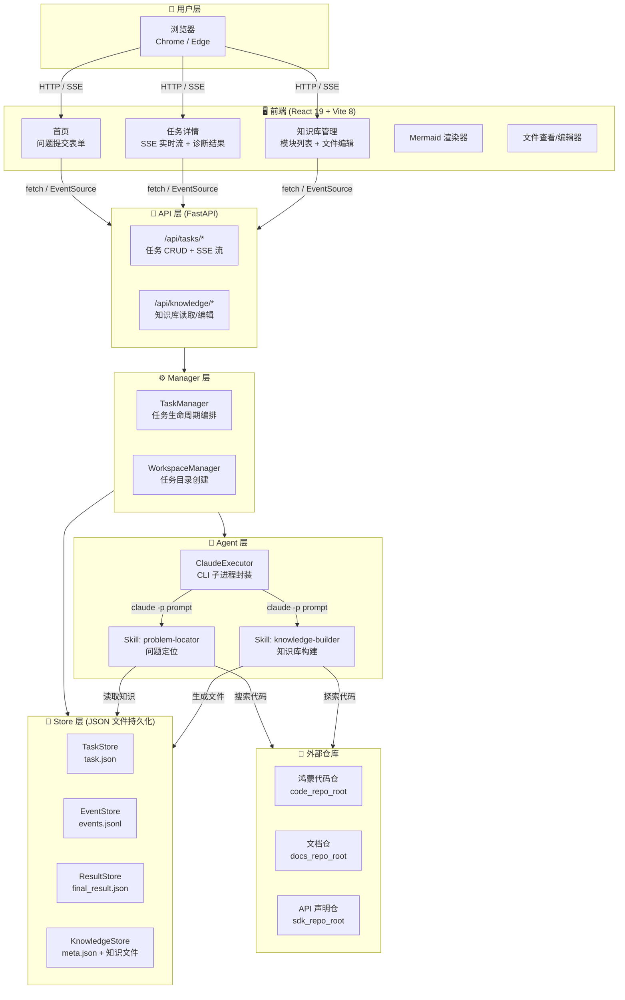

## 2. 数据流架构

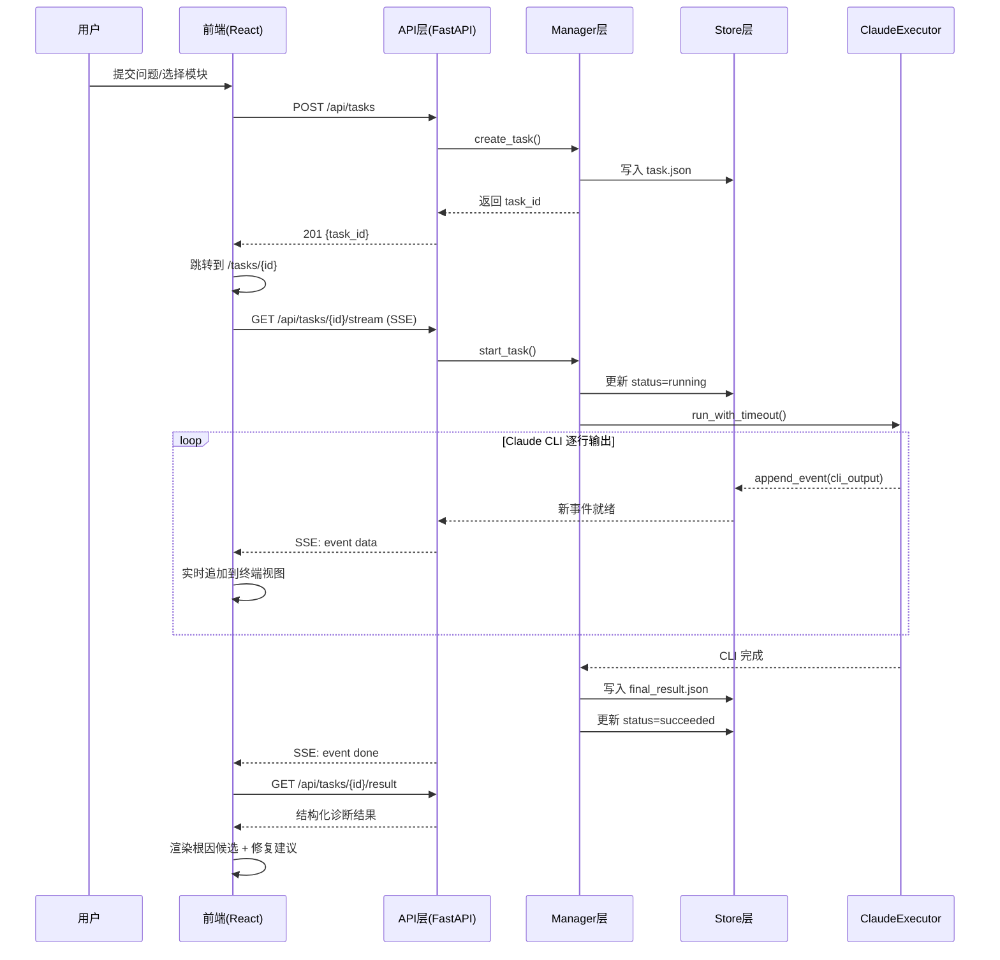

## 3. 任务状态机

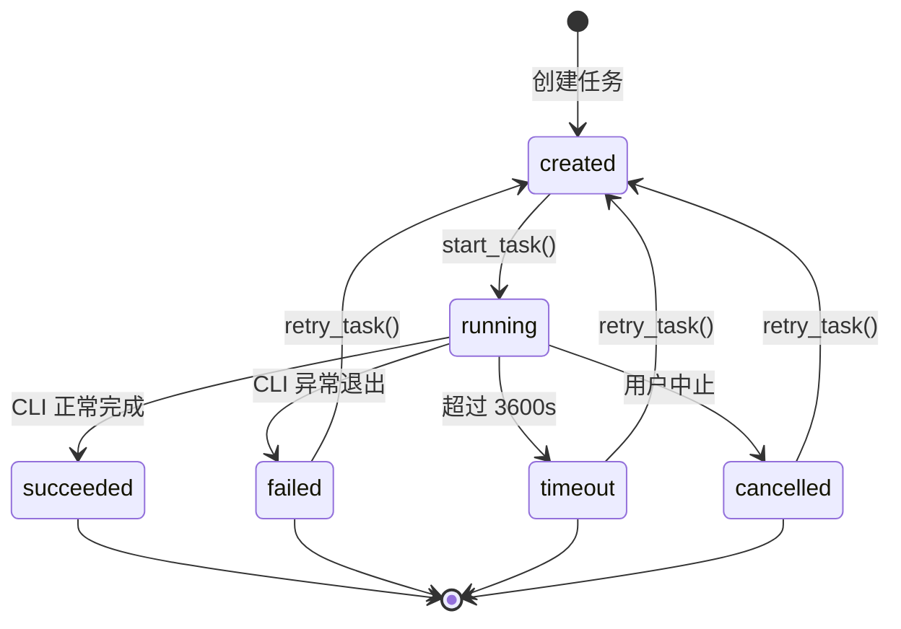

## 4. Skill 设计规范

### 4.1 Skill 架构模式

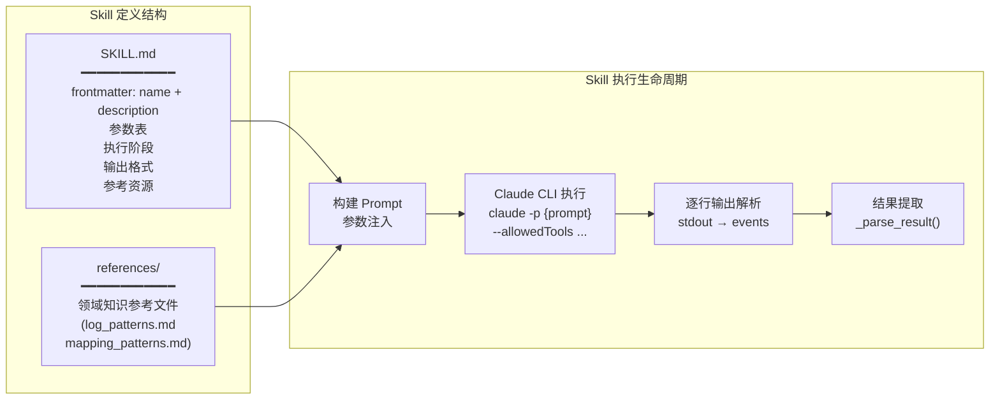

### 4.2 Skill 规范标准

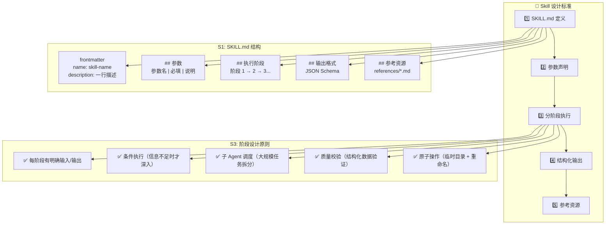

### 4.3 现有 Skill 对照

| 维度 | problem-locator | knowledge-builder |
|------|----------------|-------------------|
| **触发方式** | `/problem-locator` | `/knowledge-builder` |
| **消费者** | Agent（自动查询） | 人类 + Agent |
| **阶段数** | 5（日志解析→知识查询→代码探索→根因分析→修复建议） | 4 + 2.5（扫描→数据生成→质量检查→Wiki生成→校验） |
| **子 Agent** | 无（单 Agent 完成） | 4 个子 Agent 协作 |
| **输出** | 1 个 JSON 文件 | 8 个文件（4 结构化 + 4 Wiki） |
| **安全策略** | 只读（搜索代码和知识库） | 临时目录 + 原子重命名 |
| **参考文件** | log_patterns.md | mapping_patterns.md |

## 5. 知识库构建规范（供各领域开发者使用）

### 5.1 知识库构建 Pipeline

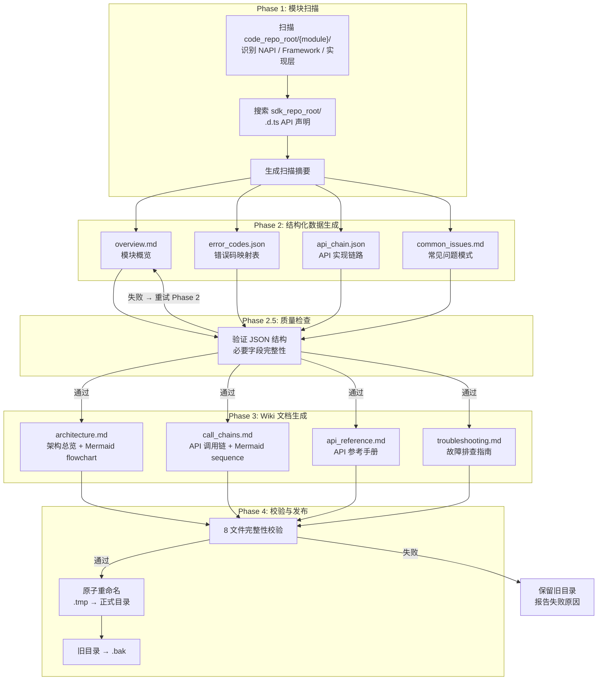

### 5.2 知识文件规范（双轨制）

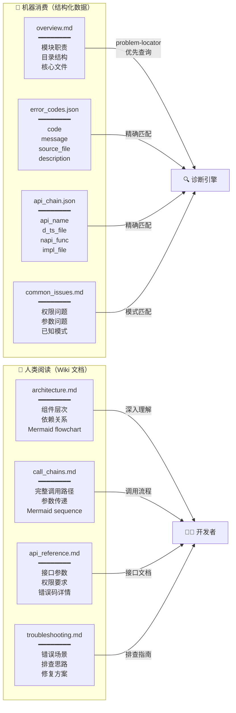

### 5.3 跨领域知识库构建指南

各开发领域的贡献者需按照以下规范编写知识库文件：

#### 目录结构

```
data/knowledge/{module_name}/
├── meta.json              ← 系统管理，不要手动创建
├── overview.md            ← 模块概览（必须）
├── error_codes.json       ← 错误码映射（必须）
├── api_chain.json         ← API 实现链路（必须）
├── common_issues.md       ← 常见问题（必须）
├── architecture.md        ← 架构总览（必须，含 Mermaid）
├── call_chains.md         ← 调用链路（必须，含 Mermaid）
├── api_reference.md       ← API 参考（必须）
└── troubleshooting.md     ← 排查指南（必须）
```

#### JSON 文件 Schema

**error_codes.json**
```json
[
  {
    "code": "string (必填)",
    "message": "string (必填)",
    "source_file": "string (必填，源文件路径)",
    "description": "string (必填，错误含义说明)"
  }
]
```

**api_chain.json**
```json
[
  {
    "api_name": "string (必填，完整 API 路径)",
    "d_ts_file": "string (.d.ts 声明文件路径)",
    "napi_func": "string (NAPI 桥接函数名)",
    "impl_file": "string (必填，实现文件路径)"
  }
]
```

#### Markdown 文件规范

**overview.md**
```markdown
# {module_name}

## 模块职责
{一段话描述模块核心功能}

## 目录结构
{简化的目录树，限 3 层深度}

## 核心文件
- `path/to/key_file` — {用途说明}
```

**architecture.md** — 必须包含 `flowchart` Mermaid 图表

**call_chains.md** — 必须包含 `sequenceDiagram` Mermaid 图表

#### 状态流转

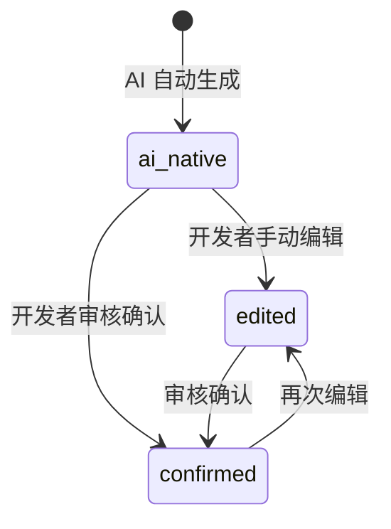

## 6. Skill 模板与贡献指南

### 6.1 模板文件结构

```
docs/templates/
├── skill-template.md                ← SKILL.md 编写模板
├── knowledge-contribution-guide.md  ← 知识库贡献指南（面向开发者）
└── skill-skeleton/                  ← 可直接复制的 Skill 目录骨架
    ├── SKILL.md                     ← Skill 定义文件模板
    └── references/
        └── domain-patterns.md       ← 领域知识参考文件模板
```

### 6.2 创建新 Skill 的流程

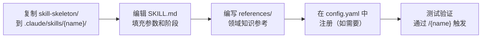

### 6.3 贡献知识库的流程

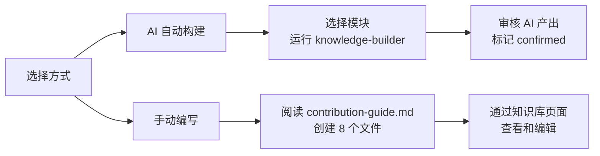

## 7. 系统约束

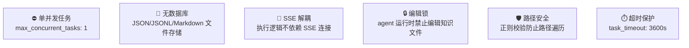
