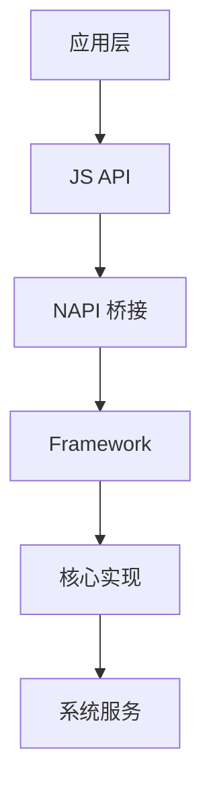
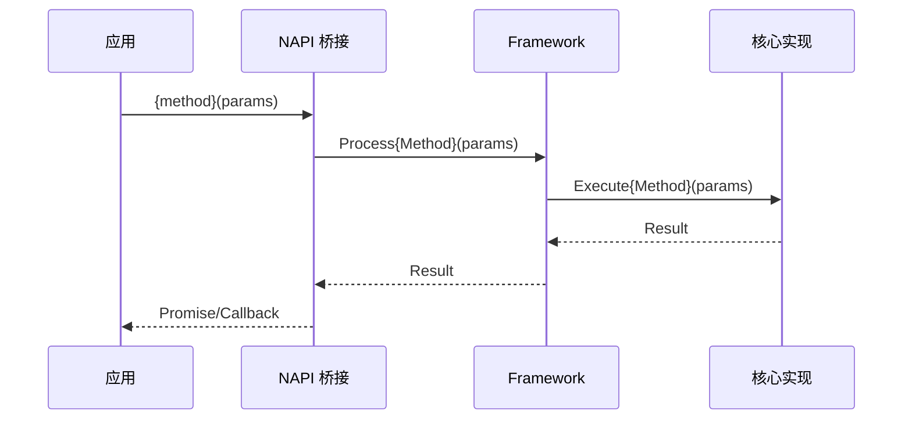

# 知识库贡献指南

> 本指南面向各开发领域的贡献者。无论你负责哪个模块（定位、多媒体、网络、UI框架...），
> 只需按照本指南的规范编写知识文件，即可让你的模块获得 AI 辅助诊断能力。

## 快速开始

### 两种贡献方式

| 方式 | 适用场景 | 操作 |
|------|---------|------|
| **AI 自动构建** | 模块在鸿蒙代码仓中有完整源码 | 在首页选择"知识库构建"，输入模块名，系统自动生成 |
| **手动编写** | 模块源码不全，或需要补充领域经验 | 按照下文规范手动创建文件 |

### 手动编写步骤

1. 在 `data/knowledge/` 下创建以模块名命名的目录
2. 按照下文的文件规范创建 8 个必须文件
3. 通过知识库页面查看效果，状态标记为 `edited`
4. 审核无误后标记为 `confirmed`

---

## 文件规范（8 个必须文件）

### 目录结构

```
data/knowledge/{module_name}/
├── overview.md            ← 模块概览
├── error_codes.json       ← 错误码映射表
├── api_chain.json         ← API 实现链路
├── common_issues.md       ← 常见问题模式
├── architecture.md        ← 架构总览（含 Mermaid）
├── call_chains.md         ← API 调用链（含 Mermaid）
├── api_reference.md       ← API 参考手册
└── troubleshooting.md     ← 故障排查指南
```

> **注意**：不要创建 `meta.json`，该文件由系统自动管理。

---

### 1. overview.md — 模块概览

**用途**：让 AI 和人类快速理解模块的职责和结构。

**模板**：

```markdown
# {module_name}

## 模块职责
{一段话描述模块核心功能，说明它解决什么问题、为谁服务}

## 目录结构
{简化的目录树，限 3 层深度，标注关键目录用途}
```
base_location/
├── frameworks/           # Framework 层
│   └── location_gnss/    # GNSS 定位实现
├── interfaces/           # 对外接口
└── test/                 # 测试用例
```

## 核心文件
- `path/to/key_file.cpp` — {用途说明}
- `path/to/another_file.h` — {用途说明}
```

---

### 2. error_codes.json — 错误码映射表

**用途**：AI 诊断时通过错误码精确匹配，定位问题根因。这是诊断引擎**最优先查询**的文件。

**Schema**：

```json
[
  {
    "code": "string (必填) — 错误码，如 '201', '3300100'",
    "message": "string (必填) — 错误消息，如 'Permission denied'",
    "source_file": "string (必填) — 定义该错误码的源文件路径",
    "description": "string (必填) — 错误含义说明和触发条件"
  }
]
```

**示例**：

```json
[
  {
    "code": "201",
    "message": "Permission denied",
    "source_file": "base_location/frameworks/location_common/common/include/location_sa_errors.h",
    "description": "调用方缺少所需权限。定位模块通常需要 ohos.permission.LOCATION 或 ohos.permission.APPROXIMATELY_LOCATION"
  },
  {
    "code": "3300100",
    "message": "Location service is disabled",
    "source_file": "base_location/frameworks/location_common/common/include/location_sa_errors.h",
    "description": "设备定位服务未开启。用户需要在设置中开启位置服务"
  }
]
```

**编写要点**：
- 每个错误码对应一条记录，不要遗漏
- `code` 必须是字符串（即使用数字也要加引号）
- `source_file` 使用相对于代码仓根目录的路径
- `description` 要说明触发条件和常见原因

---

### 3. api_chain.json — API 实现链路

**用途**：AI 诊断时追踪 API 调用从 JS 声明到 C++ 实现的完整路径。这是诊断引擎**最优先查询**的文件。

**Schema**：

```json
[
  {
    "api_name": "string (必填) — 完整 API 路径，如 'geoLocationManager.getCurrentLocation'",
    "d_ts_file": "string — .d.ts 声明文件路径",
    "napi_func": "string — NAPI 桥接函数名",
    "impl_file": "string (必填) — 实现文件路径"
  }
]
```

**示例**：

```json
[
  {
    "api_name": "geoLocationManager.getCurrentLocation",
    "d_ts_file": "interface_sdk-js/api/@ohos.geoLocationManager.d.ts",
    "napi_func": "GeoLocationManagerGetCurrentLocation",
    "impl_file": "base_location/frameworks/location_gnss/gnss/src/geo_location_manager.cpp"
  }
]
```

**编写要点**：
- `api_name` 格式为 `moduleName.methodName`
- 如果模块不是鸿蒙 NAPI 桥接模式（如纯 C/C++ 模块），`d_ts_file` 和 `napi_func` 可省略，但 `impl_file` 必须填写
- 如果模块有其他桥接方式（如 FFI），可自行添加相关字段

---

### 4. common_issues.md — 常见问题模式

**用途**：AI 诊断时快速匹配已知问题模式。

**模板**：

```markdown
# 常见问题

## 权限问题
- **错误码 201**：需要在 module.json5 中声明 `{permission_name}` 权限
- **错误码 XXX**：{问题描述和解决方案}

## 参数问题
- **错误码 401**：{常见参数错误场景}

## 初始化问题
- {模块未初始化时的表现和解决方法}

## 线程/并发问题
- {多线程使用时的注意事项}

## 已知限制
- {模块的已知限制和行为约束}
```

---

### 5. architecture.md — 架构总览

**用途**：帮助人类开发者和 AI 深入理解模块的内部架构。

**必须包含**：Mermaid `flowchart` 组件关系图。

**模板**：

```markdown
# {module_name} 架构总览

## 模块职责
{详尽描述模块的功能边界和服务对象}

## 组件层次
{各组件说明，含源文件路径引用}

- **JS API 层** (`interfaces/`)：对外暴露的 JS/TS 接口
- **NAPI 桥接层** (`frameworks/location_napi/`)：JS → C++ 的桥接转换
- **Framework 层** (`frameworks/location_{sub}/`)：业务逻辑编排
- **核心实现层** (`services/`)：底层能力实现

## 依赖关系



## 数据流
{描述关键数据在组件间的流转}
```

---

### 6. call_chains.md — API 调用链

**用途**：展示 API 从调用到实现的完整链路，帮助排查调用链上的问题。

**必须包含**：Mermaid `sequenceDiagram` 时序图。

**模板**：

```markdown
# API 调用链流程

## {api_name}

### 调用链路



### 参数说明
- `{param1}`: {类型} — {说明}
- `{param2}`: {类型} — {说明}

### 返回值
- {返回值类型和说明}
```

---

### 7. api_reference.md — API 参考手册

**用途**：完整的接口文档，包含参数、返回值、权限、错误码。

**模板**：

```markdown
# API 参考手册

## {moduleName}.{methodName}

**声明文件**：`path/to/@ohos.module.d.ts`
**实现文件**：`path/to/impl.cpp`

### 参数
| 参数名 | 类型 | 必填 | 说明 |
|--------|------|------|------|
| param1 | string | 是 | 说明 |

### 返回值
| 类型 | 说明 |
|------|------|
| Promise\<Result\> | 异步返回结果 |

### 权限要求
- `ohos.permission.XXX`

### 错误码
| 错误码 | 说明 |
|--------|------|
| 201 | 权限不足 |
| 401 | 参数错误 |

### 使用示例
```typescript
// 示例代码
```
```

---

### 8. troubleshooting.md — 故障排查指南

**用途**：面向开发者的实操排查手册，包含具体步骤和修复方案。

**模板**：

```markdown
# 故障排查指南

## 常见错误场景

### 场景 1：{错误场景名称}

**现象**：{描述用户看到的现象}

**可能原因**：
1. {原因 A}
2. {原因 B}

**排查步骤**：
1. 检查 `{config_or_log}` 中的 {字段}
2. 确认 {条件}
3. 查看 {日志位置}

**修复方案**：
- 原因 A：{修改方法，附代码位置}
- 原因 B：{修改方法}

### 场景 2：{错误场景名称}
{同上格式}

## 日志关键信息

排查时关注以下日志标签：
- `{TAG_NAME}` — {说明}
- `{TAG_NAME_2}` — {说明}

## 性能问题排查

- {性能相关的排查思路}
```

---

## 质量检查清单

提交前对照以下清单逐项检查：

### 通用检查
- [ ] 8 个文件全部存在且非空
- [ ] 文件名完全匹配规范（小写，下划线分隔）
- [ ] 文件内容使用 UTF-8 编码

### JSON 文件检查
- [ ] `error_codes.json` 是合法 JSON 数组
- [ ] 每条 error_codes 记录含 `code`、`message`、`source_file`、`description`
- [ ] `api_chain.json` 是合法 JSON 数组
- [ ] 每条 api_chain 记录含 `api_name`、`impl_file`
- [ ] `code` 和 `api_name` 字段非空字符串

### Markdown 文件检查
- [ ] `overview.md` 包含"模块职责"和"目录结构"章节
- [ ] `architecture.md` 包含 Mermaid `flowchart` 代码块
- [ ] `call_chains.md` 包含 Mermaid `sequenceDiagram` 代码块
- [ ] Wiki 文档（architecture/call_chains/api_reference/troubleshooting）中的技术断言标注了源文件路径

---

## 状态说明

知识库模块有三种状态：

| 状态 | 含义 | 说明 |
|------|------|------|
| `ai_native` | AI 自动生成 | 通过 `/knowledge-builder` 自动生成的原始文件，未经人工审核 |
| `edited` | 已编辑 | 开发者手动编辑或修改过的文件 |
| `confirmed` | 已确认 | 开发者审核确认内容准确 |

**推荐流程**：AI 自动生成 → 开发者审核确认（`confirmed`）→ 有更新时编辑（`edited`）→ 再次确认
